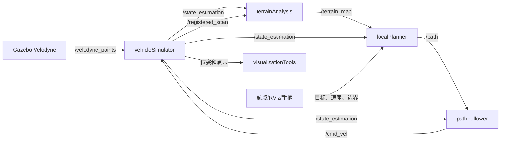

# 自主探索开发环境：项目与接口指南

## 1. 项目是什么

本仓库是一个 ROS1/catkin 地面机器人自主导航开发环境。它提供两种运行模式：

- 仿真模式：Gazebo 产生 Velodyne 点云，简化车辆模型接受控制并反馈位姿。
- 实机模式：外部 SLAM/里程计系统提供已定位点云与位姿，`loam_interface` 将其适配为项目内部接口。

无论输入来自仿真还是真机，内部主链路保持一致：

```text
定位 + 已配准点云
  -> 地形分析
  -> 局部路径选择
  -> 路径跟踪
  -> 速度控制
  -> 仿真车辆或真实底盘
```

项目采用 ROS1 的发布/订阅模型。节点不直接彼此调用，而是通过命名话题传递消息；因此替换传感器、SLAM 或底盘时，优先保持话题的名称、消息类型、坐标系和单位契约不变。

## 2. 开始前需要知道的 ROS 概念

| 名词 | 在本项目中的意义 |
| --- | --- |
| catkin 工作区 | 包含 `src/`、构建产物 `build/` 和环境 `devel/` 的 ROS1 工程目录。 |
| package | 可独立构建、声明依赖、安装节点的单元，例如 `local_planner`。 |
| node | 正在运行的 ROS 程序，例如 `localPlanner`。 |
| topic | 多个节点间的异步数据通道，例如 `/registered_scan`。 |
| message | 话题中的结构化数据，如 `nav_msgs/Odometry`。 |
| launch | XML 启动编排文件，可一次拉起多节点并传递参数。 |
| parameter | 节点启动时读取的可配置数值；本项目通常由 launch 文件设置。 |
| TF | 坐标系树。本项目主要使用全局 `map`、传感器 `sensor`、车辆 `vehicle`。 |

最小排查原则：先执行 `rostopic list` 看话题是否存在，再用 `rostopic echo -n 1 <topic>` 看消息是否正确，最后用 RViz 检查 `frame_id` 和 TF。

## 3. 目录与包结构

```text
README.md                         项目概述
docs/PROJECT_GUIDE_ZH.md          本指南
src/                              catkin 工作区源码目录和顶层 CMake 文件
  vehicle_simulator/              Gazebo 适配、车辆模型、场景、URDF、RViz 配置
  local_planner/                  局部路径选择和路径跟踪
  terrain_analysis/               面向避障的局部可通行性地图
  terrain_analysis_ext/           大范围/连通性增强地形图
  loam_interface/                 外部 SLAM 到内部接口的适配层
  sensor_scan_generation/         点云时刻同步及传感器帧点云恢复
  visualization_tools/            探索指标、轨迹和地图可视化
  waypoint_example/               文件航点与边界发布示例
  waypoint_rviz_plugin/           RViz 鼠标点选目标工具
  joystick_drivers/               ROS joy 和 PS3 手柄驱动
  velodyne_simulator/             Gazebo Velodyne 模型与插件
```

其中 `joy` 和 `velodyne_simulator` 属于通用底层驱动/仿真能力；其余包共同实现本项目的导航流程。

## 4. 系统架构和数据流

### 4.1 仿真闭环



`vehicleSimulator` 是仿真闭环的边界：它把 Gazebo 点云转到地图坐标系，消费 `/cmd_vel`，并发布项目统一的 `/state_estimation` 与 `/registered_scan`。

### 4.2 实机闭环


实机启动文件不包含真正的底盘驱动。你必须另行运行一个节点，订阅 `/cmd_vel` 并转换成底盘通信协议。

## 5. 运行方式

### 5.1 环境与构建

本仓库自身包含 `src/CMakeLists.txt`，按独立 catkin 工作区使用。以下命令应在包含 `README.md` 的目录执行：

```bash
source /opt/ros/$ROS_DISTRO/setup.bash
catkin_make
source devel/setup.bash
```

主要依赖为 ROS1、catkin、PCL、tf、Gazebo/gazebo_ros、OpenCV、xacro 和 RViz。若要重新生成候选路径库，另需 Python 3 的 `numpy`、`scipy`、`matplotlib`。

若将仓库放入另一个既有工作区的 `src/` 下，不要嵌套构建工作区；应将本仓库中的各 ROS 包作为上层工作区的源码包，或单独保持本仓库为一个工作区。

### 5.2 启动仿真

```bash
roslaunch vehicle_simulator system_garage.launch
```

可替换入口为 `system_campus.launch`、`system_forest.launch`、`system_indoor.launch` 与 `system_tunnel.launch`。默认 Gazebo GUI 关闭，可传入 `gazebo_gui:=true`。这些入口都会启动规划、地形分析、仿真、可视化、RViz 和 PS3 手柄驱动。

### 5.3 启动航点任务

在一个已启动的仿真系统中另开终端，重新 `source devel/setup.bash` 后运行：

```bash
roslaunch waypoint_example waypoint_example_garage.launch
```

它从 PLY 文件读取航点与多边形边界，发布 `/way_point`、`/speed`、`/navigation_boundary`。也可在 RViz 选择 `Waypoint` 工具并在地图点选目标。

### 5.4 启动实机链路

```bash
roslaunch vehicle_simulator system_real_robot.launch use_joystick:=true
```

启动前须确保外部系统正在发布 `/odin1/odometry` 和 `/odin1/cloud_slam`。默认参数见 `loam_interface/launch/loam_interface.launch`；若外部话题或坐标约定不同，应修改该处参数而非下游规划代码。

## 6. 核心接口契约

### 6.1 主数据话题

| 话题 | 类型 | 发布者 | 消费者 | 契约 |
| --- | --- | --- | --- | --- |
| `/state_estimation` | `nav_msgs/Odometry` | 仿真器或 LOAM 适配器 | 地形、规划、跟踪、统计等 | 全局位姿。`header.frame_id=map`，`child_frame_id=sensor`，长度为米、角度为弧度。 |
| `/registered_scan` | `sensor_msgs/PointCloud2` | 仿真器或 LOAM 适配器 | 地形、规划、统计、扫描生成器 | 已变换到 `map` 的点云。建议使用 `PointXYZI`；适配器可把无 intensity 的输入补为零。 |
| `/terrain_map` | `sensor_msgs/PointCloud2` | `terrainAnalysis` | 局部规划器、仿真器、扩展地形 | `xyz` 是地图坐标；`intensity` 是相对地面的高差/通行代价，不能当作雷达反射强度。 |
| `/path` | `nav_msgs/Path` | `localPlanner` | `pathFollower` | 局部路径。其坐标相对“路径接收时的车辆姿态”，不是绝对 `map` 路径。`z` 的正负用作前进/倒退标记。 |
| `/cmd_vel` | `geometry_msgs/Twist` | `pathFollower` | 仿真器或真实底盘驱动 | 使用 `linear.x` 表示前向速度 m/s，`angular.z` 表示偏航角速度 rad/s。 |

### 6.2 任务、人工和安全接口

| 话题 | 类型 | 用途 |
| --- | --- | --- |
| `/way_point` | `geometry_msgs/PointStamped` | 全局地图坐标中的当前目标点。 |
| `/speed` | `std_msgs/Float32` | 自主模式的目标速度 m/s。 |
| `/navigation_boundary` | `geometry_msgs/PolygonStamped` | 禁止越界的闭合多边形边界；规划器将其转为障碍点。 |
| `/added_obstacles` | `sensor_msgs/PointCloud2` | 外部人工注入的障碍物。 |
| `/check_obstacle` | `std_msgs/Bool` | 启用或关闭规划器碰撞检查。 |
| `/two_way_drive` | `std_msgs/Bool` | 允许或禁止倒车。 |
| `/stop` | `std_msgs/Int8` | `1` 停止线速度，`2` 同时停止转向。 |
| `/joy` | `sensor_msgs/Joy` | 手柄输入，同时影响手动/自主模式、速度、方向和地图清理。 |
| `/map_clearing` | `std_msgs/Float32` | 清理基础地形图一定半径内的数据。 |
| `/cloud_clearing` | `std_msgs/Float32` | 清理扩展地形图一定半径内的数据。 |

### 6.3 可视化和辅助输出

`/sensor_scan` 和 `/state_estimation_at_scan` 由 `sensorScanGeneration` 产生，代表与点云时间同步的传感器帧数据。`visualizationTools` 发布 `/overall_map`、`/explored_areas`、`/trajectory`、`/explored_volume`、`/traveling_distance`、`/time_duration`，并把指标和轨迹写入 `vehicle_simulator/log/`。

## 7. 节点内部逻辑

### 7.1 定位与点云适配

`loamInterface` 在 `loam_interface/src/loamInterface.cpp` 中订阅可配置的外部里程计和配准点云。参数 `flipStateEstimation` 与 `flipRegisteredScan` 用于修正外部系统的坐标轴约定，`sendTF` 和 `reverseTF` 控制 TF 广播方向。

替换 SLAM 时，请逐项验证：时间戳是否同源、位姿与点云是否同属 `map`、四元数是否遵从 ROS 右手系、点云是否至少含 `x/y/z` 字段。不要仅通过 RViz 的“看起来方向正确”判断，需检查机器人移动一米时对应坐标轴是否增加一米。

### 7.2 地形分析

`terrainAnalysis` 在车辆周围维护 $21 \times 21$ 个边长 1 m 的滚动体素。它裁剪高度范围内的配准点云，按时间衰减旧点并下采样；随后在 $0.2$ m 平面栅格中估计地面高度，输出每个有效点相对地面的高度。

关键参数：

- `scanVoxelSize`：点云下采样分辨率，减小会提高细节与 CPU 开销。
- `decayTime` 与 `noDecayDis`：远处旧观测的保留时间与近处不衰减半径。
- `minRelZ`、`maxRelZ`、`disRatioZ`：相对车辆的高度裁剪带。
- `vehicleHeight`：高差达到该高度以上的点不会作为可通行地形输出。
- `considerDrop`：将下坠也视为障碍，适合有台阶或坑洞的场景。
- `noDataObstacle`：把无观测区域标为障碍，安全性更高但更保守。

### 7.3 局部规划

`localPlanner` 不是在线 A* 或 MPC。它从 `local_planner/paths/` 读取预生成轨迹库：

- `startPaths.ply`：7 组用于实际输出的局部路径。
- `paths.ply`：343 条用于碰撞检测的候选轨迹。
- `pathList.ply`：候选轨迹终点方向及分组。
- `correspondences.txt`：每个规划体素会阻塞哪些候选轨迹的倒排表。

在线运行时，规划器将障碍转到车体局部坐标，对 36 个朝向旋转候选轨迹，借助倒排表快速累计碰撞数；随后按目标方向、转向幅度、地形代价和安全约束评分，选择最高分路径。`pathScale`、`pathRange` 可以随速度缩小，从而提高高速时的反应能力。

### 7.4 跟踪控制

`pathFollower` 接收路径时记录当前车辆位姿，将后续实时位姿换算回路径局部系。它选择距离大于 `lookAheadDis` 的前视点，按航向误差产生偏航角速度，并对速度施加路径末端减速、最大加速度、坡度减速及安全停止逻辑。

### 7.5 扩展地形与统计

`terrainAnalysisExt` 使用更大范围的滚动地图和 $0.4$ m 平面栅格。`checkTerrainConn=true` 时从车辆下方地面开始做高度连通传播，减少天花板或跨层结构被当作地面的风险。其输出 `/terrain_map_ext` 目前不直接参与默认局部规划。

## 8. 修改和扩展指南

### 8.1 修改参数，而不是先改源码

调参应优先在对应 launch 文件中完成：

- 规划/控制参数：`local_planner/launch/local_planner.launch`。
- 基础地形参数：`terrain_analysis/launch/terrain_analysis.launch`。
- 扩展地形参数：`terrain_analysis_ext/launch/terrain_analysis_ext.launch`。
- 仿真动力学、初始位姿和场景：`vehicle_simulator/launch/vehicle_simulator.launch`。
- 外部 SLAM 接口：`loam_interface/launch/loam_interface.launch`。

每次只改变一个变量，并记录场景、参数、速度、失败现象和 ROS bag。传感器分辨率改变时，通常应先重新检查 `scanVoxelSize`、`minBlockPointNum`、`obstacleHeightThre` 和 `pointPerPathThre`。

### 8.2 更换真实 SLAM

1. 在适配器 launch 中填入新 SLAM 的里程计和配准点云话题。
2. 检查是否需要设置 `flipStateEstimation`、`flipRegisteredScan`。
3. 确保适配器输出的 `/state_estimation` 与 `/registered_scan` 均为 `map` 坐标。
4. 在不接入底盘前，用 RViz 与 `rostopic echo` 验证路径和 `/cmd_vel`。
5. 最后才连接底盘驱动，并从低速、小范围、可急停的环境开始测试。

### 8.3 更换底盘驱动

新增一个节点订阅 `/cmd_vel`，将 `linear.x`、`angular.z` 转为底盘协议；同时加入命令超时保护，超时必须输出零速度。底盘真实里程计或 SLAM 的位姿仍须经 `loam_interface` 统一到 `/state_estimation`。不要让两个节点同时发布同一个控制话题。

### 8.4 修改车辆尺寸或候选轨迹

改变 `vehicleLength`、`vehicleWidth`、`searchRadius`、`gridVoxelSize`、`gridVoxelOffsetX/Y` 时，必须同步重新生成路径库和 `correspondences.txt`，否则碰撞查询的网格契约失效。

在 `local_planner/paths/` 中执行：

```bash
python3 path_generator.py
```

该脚本的体素尺寸、范围与 `localPlanner.cpp` 的编译期常量必须一致。生成完成后，检查四个 PLY/TXT 文件均已更新，再重新启动 `localPlanner`。

### 8.5 新增一个 ROS 节点

1. 在目标包 `src/` 下加入源文件，并明确输入/输出话题、消息类型、坐标系和频率。
2. 在包的 `CMakeLists.txt` 中添加 `add_executable` 和 `target_link_libraries`。
3. 在 `package.xml` 添加实际使用的依赖。
4. 在包的 `launch/` 中添加节点和参数，必要时再由系统 launch include。
5. 重新运行 `catkin_make`，然后 `source devel/setup.bash`。
6. 用 `rosnode info`、`rostopic info` 和 RViz 验证连接、频率与坐标系。

## 9. 调试与常见问题

```bash
rosnode list
rostopic list
rostopic info /registered_scan
rostopic echo -n 1 /state_estimation
rostopic hz /terrain_map
rosrun tf tf_echo map sensor
roswtf
```

| 现象 | 优先检查 |
| --- | --- |
| RViz 没有点云 | `/registered_scan` 是否存在，消息 `frame_id` 是否为 `map`，TF 是否可从 `map` 到显示坐标系。 |
| 规划器不出路径 | `/terrain_map` 是否有数据，`paths/` 四个文件是否齐全，目标点是否有效，`checkObstacle` 是否把所有路径阻塞。 |
| 车辆不移动 | `/path` 是否有效，`/cmd_vel` 是否持续发布，仿真器或底盘驱动是否订阅它，`/stop` 是否触发。 |
| 机器人方向异常 | 检查 SLAM 坐标轴、`flip*` 参数、`sensorOffsetX/Y` 和 `map -> sensor` TF。 |
| 地图闪烁或障碍不稳定 | 检查点云时间戳、位姿同步、`decayTime`、下采样大小和地形高度范围。 |
| 编译后找不到包/节点 | 在当前终端执行 `source devel/setup.bash`，确认 `ROS_PACKAGE_PATH` 包含本工作区。 |

## 10. 推荐学习顺序

1. 运行 `system_garage.launch`，在 RViz 中观察 `/registered_scan`、`/terrain_map`、`/path` 和 `/cmd_vel`。
2. 阅读 `vehicle_simulator/launch/system_garage.launch`，理解一个系统 launch 如何组合各个包。
3. 阅读 `vehicle_simulator/src/vehicleSimulator.cpp`，建立闭环输入输出概念。
4. 阅读 `terrain_analysis/src/terrainAnalysis.cpp`，理解点云如何变为地形高差。
5. 阅读 `local_planner/src/localPlanner.cpp`，结合路径库了解快速候选路径筛选。
6. 阅读 `local_planner/src/pathFollower.cpp`，理解从路径到速度命令的控制过程。
7. 最后阅读 `loam_interface/src/loamInterface.cpp`，再着手接入真实机器人。

遵守上述接口契约时，系统中每个模块均可独立替换：例如以新的地形代价图替换 `/terrain_map` 的生成者，或以新的控制器替换 `/cmd_vel` 的生成者。替换前先用 ROS 工具验证话题类型、时间戳、坐标系、单位和频率，这比直接修改下游算法更可靠。

## 11. 按模块理解具体原理

### 11.1 `vehicle_simulator`：闭环仿真执行器

Gazebo 负责渲染环境和产生 `/velodyne_points`；`vehicleSimulator` 不使用 Gazebo 的刚体动力学控制车辆，而是在 200 Hz 循环中积分一个简化的平面运动模型：由 `/cmd_vel` 给出的线速度和偏航角速度更新车辆 $x$、$y$、$yaw$。它再从 `/terrain_map` 中选取车辆邻域的低矮点，用平均高度估计车底地面高度，并以最小二乘拟合地面斜率，进而得到车身的 $z$、roll、pitch。

随后节点把计算出的位姿发送到 Gazebo 中的 camera、lidar、robot 模型，使传感器位置跟随控制结果；并将原始激光点绕估计的地面姿态旋转、平移到 `map`，形成 `/registered_scan`。这就是仿真闭环中“控制影响位姿，位姿影响下一帧点云，点云又影响下一次控制”的原因。

### 11.2 `loam_interface`：真实系统的坐标与消息防火墙

不同 SLAM 系统常有不同坐标轴定义和点云字段。该节点将外部话题转换成下游唯一认得的接口：`/state_estimation` 和 `/registered_scan`。开启 `flipStateEstimation` 时，位置由外部 $(x,y,z)$ 重排为 $(z,x,y)$，姿态也按相同几何关系转换；开启 `flipRegisteredScan` 时点云做同样轴重排。

它还检查 `PointCloud2.fields`。若没有 `intensity`，先解析为 `PointXYZ`，再转换为 `PointXYZI` 并填零。这保证 `terrain_analysis` 可始终用 PCL 的同一类型解析输入。注意：此处强制将输出标为 `map`，所以只有当外部输入实际上已经在同一全局坐标中时才正确。

### 11.3 `terrain_analysis`：从三维点云提取障碍高度

该节点的难点不是单纯保存点云，而是给每个点找到“本地地面基准”。每帧先将点云裁剪到车辆附近和允许的相对高度范围，并在每个点中写入采集时间作为临时 intensity。滚动体素地图随车辆跨越 1 m 网格而搬移，过期点按 `decayTime` 删除，再做体素下采样控制点数。

接着将附近点投影到二维 $0.2$ m 平面格。一个点同时加入邻近 $3 \times 3$ 格，减少格边界的不连续性；每格最低点或 `quantileZ` 分位数被当作地面高度。最终点的输出 intensity 为 $z-z_{ground}$；若 `considerDrop=true`，则使用绝对值，使凹坑和突起都形成代价。

动态障碍清除选项 `clearDyObs` 利用车辆姿态把点转到车体系，依据垂直视场和遮挡关系判断某格是否可能是动态物体；无数据保护选项则把长期未观测的格扩张为障碍。规划器只需读取最终高度差，无需重复执行地面分割。

### 11.4 `terrain_analysis_ext`：长距离地形和连通性过滤

扩展版本将体素地图扩大为 $41 \times 41$、每格 2 m，平面栅格改为 $0.4$ m。它对远处点执行与基础版本相近的地面估计，但可从车辆中心格开始做洪泛搜索：只有与相邻可达地面高度差小于 `terrainConnThre` 的栅格才被标记为连通。高度突变超过 `ceilingFilteringThre` 的区域会被排除，用于降低隧道顶棚、多层结构被当作地面的风险。

为避免近场数据出现两套不一致表示，`localTerrainMapRadius` 内直接复用 `/terrain_map`，半径外才采用扩展节点计算的结果。该模块当前是信息增强输出；默认 `localPlanner` 仍订阅基础 `/terrain_map`。

### 11.5 `local_planner`：预计算碰撞关系的候选轨迹规划

传统在线规划会对每次点云重新让每条轨迹与每个障碍做距离计算。本项目把昂贵的几何关系前置：离线脚本生成候选曲线，并对每个局部二维体素保存“该体素被占据时哪些路径会碰撞”的列表。运行时一个障碍点只需计算格索引，然后递增对应路径的阻塞计数，时间复杂度显著低于逐路径逐点检查。

候选轨迹分为 7 个形状组、343 条碰撞检测曲线，并可绕车体旋转 36 个方向。规划器将目标转换至车体系，以目标方向筛除无关朝向；对未达到 `pointPerPathThre` 碰撞点数的路径计算分数。分数综合方向偏差、转向朝向、轨迹组和地形高度惩罚，得分最高的组生成 `/path`。若前向无路且允许倒车，会再以反向目标方向尝试。

### 11.6 `pathFollower`：前视几何跟踪与保护逻辑

路径到达时，跟踪器冻结当时车辆在 `map` 中的参考姿态。后续每个周期把实时车辆位置逆变换到该参考系，因此可直接和路径局部点比较。它不断跳过已进入 `lookAheadDis` 的点，将下一个前视点的方位作为期望方向；当前偏航与期望方向之差乘以增益，得到角速度命令。

速度不是立刻跳变到目标值：它受 `maxAccel` 的每周期增量限制，接近路径末端时按剩余距离比例降低，还可因过大坡度或坡度角速度暂时减速/停车。`/stop` 是优先级更高的安全覆盖，能在规划仍输出路径时强制停线速度或全部转向。

### 11.7 `sensor_scan_generation`：恢复扫描瞬间的传感器坐标

`/registered_scan` 已是世界坐标点云，而许多建图或感知算法需要传感器自身坐标系。该节点用 `message_filters::ApproximateTime` 配对里程计和点云，将每个世界点乘以扫描时刻位姿的逆变换，输出 `sensor_at_scan` 坐标系的 `/sensor_scan`；同时发布同一时间戳的 `/state_estimation_at_scan` 和 `map -> sensor_at_scan` TF。

### 11.8 `visualization_tools` 与航点工具：观测层和任务层

统计节点累积已配准扫描：以大体素下采样的点数乘体素体积估算探索体积，以车辆位移增量累积行驶距离，并从场景 PLY 加载全局地图。航点示例只做任务级状态机：抵达当前点、等待 `waitTime`、切换下一点，期间持续发布目标、速度和边界。RViz 插件则把鼠标点击转换为 `/way_point`，并发布一个模拟 `/joy` 消息让系统进入相应控制状态。