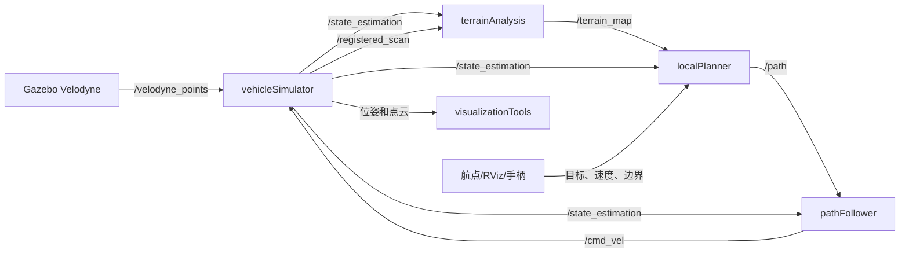
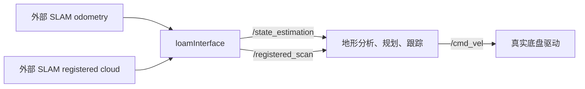

# 自主探索开发环境：项目与接口指南

## 1. 项目是什么

本仓库是一个 ROS1/catkin 地面机器人自主导航开发环境。它提供两种运行模式：

- 仿真模式：Gazebo 产生 Velodyne 点云，简化车辆模型接受控制并反馈位姿。
- 实机模式：外部 SLAM/里程计系统提供已定位点云与位姿，`loam_interface` 将其适配为项目内部接口。

无论输入来自仿真还是真机，内部主链路保持一致：

```text
定位 + 已配准点云
  -> 地形分析
  -> 局部路径选择
  -> 路径跟踪
  -> 速度控制
  -> 仿真车辆或真实底盘
```

项目采用 ROS1 的发布/订阅模型。节点不直接彼此调用，而是通过命名话题传递消息；因此替换传感器、SLAM 或底盘时，优先保持话题的名称、消息类型、坐标系和单位契约不变。

## 2. 开始前需要知道的 ROS 概念

| 名词 | 在本项目中的意义 |
| --- | --- |
| catkin 工作区 | 包含 `src/`、构建产物 `build/` 和环境 `devel/` 的 ROS1 工程目录。 |
| package | 可独立构建、声明依赖、安装节点的单元，例如 `local_planner`。 |
| node | 正在运行的 ROS 程序，例如 `localPlanner`。 |
| topic | 多个节点间的异步数据通道，例如 `/registered_scan`。 |
| message | 话题中的结构化数据，如 `nav_msgs/Odometry`。 |
| launch | XML 启动编排文件，可一次拉起多节点并传递参数。 |
| parameter | 节点启动时读取的可配置数值；本项目通常由 launch 文件设置。 |
| TF | 坐标系树。本项目主要使用全局 `map`、传感器 `sensor`、车辆 `vehicle`。 |

最小排查原则：先执行 `rostopic list` 看话题是否存在，再用 `rostopic echo -n 1 <topic>` 看消息是否正确，最后用 RViz 检查 `frame_id` 和 TF。

## 3. 目录与包结构

```text
README.md                         项目概述
docs/PROJECT_GUIDE_ZH.md          本指南
src/                              catkin 工作区源码目录和顶层 CMake 文件
  vehicle_simulator/              Gazebo 适配、车辆模型、场景、URDF、RViz 配置
  local_planner/                  局部路径选择和路径跟踪
  terrain_analysis/               面向避障的局部可通行性地图
  terrain_analysis_ext/           大范围/连通性增强地形图
  loam_interface/                 外部 SLAM 到内部接口的适配层
  sensor_scan_generation/         点云时刻同步及传感器帧点云恢复
  visualization_tools/            探索指标、轨迹和地图可视化
  waypoint_example/               文件航点与边界发布示例
  waypoint_rviz_plugin/           RViz 鼠标点选目标工具
  joystick_drivers/               ROS joy 和 PS3 手柄驱动
  velodyne_simulator/             Gazebo Velodyne 模型与插件
```

其中 `joy` 和 `velodyne_simulator` 属于通用底层驱动/仿真能力；其余包共同实现本项目的导航流程。

## 4. 系统架构和数据流

### 4.1 仿真闭环



`vehicleSimulator` 是仿真闭环的边界：它把 Gazebo 点云转到地图坐标系，消费 `/cmd_vel`，并发布项目统一的 `/state_estimation` 与 `/registered_scan`。

### 4.2 实机闭环



实机启动文件不包含真正的底盘驱动。你必须另行运行一个节点，订阅 `/cmd_vel` 并转换成底盘通信协议。

## 5. 运行方式

### 5.1 环境与构建

本仓库自身包含 `src/CMakeLists.txt`，按独立 catkin 工作区使用。以下命令应在包含 `README.md` 的目录执行：

```bash
source /opt/ros/$ROS_DISTRO/setup.bash
catkin_make
source devel/setup.bash
```

主要依赖为 ROS1、catkin、PCL、tf、Gazebo/gazebo_ros、OpenCV、xacro 和 RViz。若要重新生成候选路径库，另需 Python 3 的 `numpy`、`scipy`、`matplotlib`。

若将仓库放入另一个既有工作区的 `src/` 下，不要嵌套构建工作区；应将本仓库中的各 ROS 包作为上层工作区的源码包，或单独保持本仓库为一个工作区。

### 5.2 启动仿真

```bash
roslaunch vehicle_simulator system_garage.launch
```

可替换入口为 `system_campus.launch`、`system_forest.launch`、`system_indoor.launch` 与 `system_tunnel.launch`。默认 Gazebo GUI 关闭，可传入 `gazebo_gui:=true`。这些入口都会启动规划、地形分析、仿真、可视化、RViz 和 PS3 手柄驱动。

### 5.3 启动航点任务

在一个已启动的仿真系统中另开终端，重新 `source devel/setup.bash` 后运行：

```bash
roslaunch waypoint_example waypoint_example_garage.launch
```

它从 PLY 文件读取航点与多边形边界，发布 `/way_point`、`/speed`、`/navigation_boundary`。也可在 RViz 选择 `Waypoint` 工具并在地图点选目标。

### 5.4 启动实机链路

```bash
roslaunch vehicle_simulator system_real_robot.launch use_joystick:=true
```

启动前须确保外部系统正在发布 `/odin1/odometry` 和 `/odin1/cloud_slam`。默认参数见 `loam_interface/launch/loam_interface.launch`；若外部话题或坐标约定不同，应修改该处参数而非下游规划代码。

### 5.5 在线调参

项目已为主要运行节点接入 ROS1 `dynamic_reconfigure`，启动系统并加载工作区后执行：

```bash
source devel/setup.bash
rosrun rqt_reconfigure rqt_reconfigure
```

可在线调节的节点和配置文件如下：

| 节点 | 配置文件 | 适合在线调节的内容 |
| --- | --- | --- |
| `loamInterface` | `loam_interface/cfg/LoamInterface.cfg` | 坐标轴翻转、TF 发布方向 |
| `localPlanner` | `local_planner/cfg/LocalPlanner.cfg` | 障碍阈值、规划范围、路径尺度、目标代价和自主速度 |
| `pathFollower` | `local_planner/cfg/PathFollower.cfg` | 前视距离、转向增益、速度、加速度、减速和安全保护 |
| `terrainAnalysis` | `terrain_analysis/cfg/TerrainAnalysis.cfg` | 地面估计、点云衰减、动态障碍和未知区域阈值 |
| `terrainAnalysisExt` | `terrain_analysis_ext/cfg/TerrainAnalysisExt.cfg` | 扩展地图衰减、地形连通性和顶棚过滤 |
| `vehicleSimulator` | `vehicle_simulator/cfg/VehicleSimulator.cfg` | 仿真地形跟随、车辆高度、初始偏航和时间对齐 |
| `visualizationTools` | `visualization_tools/cfg/VisualizationTools.cfg` | 统计采样和可视化体素大小 |

话题名、路径库文件夹、路径网格尺寸、候选路径数量、传感器安装偏移和文件路径仍属于启动期契约，未开放为在线参数。修改这些内容需要重新启动节点；尤其不要在线修改 `gridVoxelSize`、`gridVoxelOffsetX/Y` 或 `pathFolder`，否则会造成路径倒排表和运行时索引不一致。

在线调参建议：先低速运行，修改一个参数后观察 `/terrain_map`、`/free_paths`、`/path` 和 `/cmd_vel`，确认效果后记录参数。`rqt_reconfigure` 修改的是节点当前运行参数，节点重启后仍以 launch 文件中的值为初始来源，因此最终确定的参数应同步回 launch 文件。

## 6. 核心接口契约

### 6.1 主数据话题

| 话题 | 类型 | 发布者 | 消费者 | 契约 |
| --- | --- | --- | --- | --- |
| `/state_estimation` | `nav_msgs/Odometry` | 仿真器或 LOAM 适配器 | 地形、规划、跟踪、统计等 | 全局位姿。`header.frame_id=map`，`child_frame_id=sensor`，长度为米、角度为弧度；`pose.position.z` 是 `sensor` 原点的地图高度，不自动等同于车辆几何中心或底盘底面高度。 |
| `/registered_scan` | `sensor_msgs/PointCloud2` | 仿真器或 LOAM 适配器 | 地形、规划、统计、扫描生成器 | 已变换到 `map` 的点云。建议使用 `PointXYZI`；适配器可把无 intensity 的输入补为零。 |
| `/terrain_map` | `sensor_msgs/PointCloud2` | `terrainAnalysis` | 局部规划器、仿真器、扩展地形 | `xyz` 是地图坐标；`intensity` 是相对地面的高差/通行代价，不能当作雷达反射强度。 |
| `/path` | `nav_msgs/Path` | `localPlanner` | `pathFollower` | 局部路径。其坐标相对“路径接收时的车辆姿态”，不是绝对 `map` 路径。`z` 的正负用作前进/倒退标记。 |
| `/cmd_vel` | `geometry_msgs/Twist` | `pathFollower` | 仿真器或真实底盘驱动 | 使用 `linear.x` 表示前向速度 m/s，`angular.z` 表示偏航角速度 rad/s。 |

### 6.2 任务、人工和安全接口

| 话题 | 类型 | 用途 |
| --- | --- | --- |
| `/way_point` | `geometry_msgs/PointStamped` | 全局地图坐标中的当前目标点。 |
| `/speed` | `std_msgs/Float32` | 自主模式的目标速度 m/s。 |
| `/navigation_boundary` | `geometry_msgs/PolygonStamped` | 禁止越界的闭合多边形边界；规划器将其转为障碍点。 |
| `/added_obstacles` | `sensor_msgs/PointCloud2` | 外部人工注入的障碍物。 |
| `/check_obstacle` | `std_msgs/Bool` | 启用或关闭规划器碰撞检查。 |
| `/two_way_drive` | `std_msgs/Bool` | 允许或禁止倒车。 |
| `/stop` | `std_msgs/Int8` | `1` 停止线速度，`2` 同时停止转向。 |
| `/joy` | `sensor_msgs/Joy` | 手柄输入，同时影响手动/自主模式、速度、方向和地图清理。 |
| `/map_clearing` | `std_msgs/Float32` | 清理基础地形图一定半径内的数据。 |
| `/cloud_clearing` | `std_msgs/Float32` | 清理扩展地形图一定半径内的数据。 |

### 6.3 可视化和辅助输出

`/sensor_scan` 和 `/state_estimation_at_scan` 由 `sensorScanGeneration` 产生，代表与点云时间同步的传感器帧数据。`visualizationTools` 发布 `/overall_map`、`/explored_areas`、`/trajectory`、`/explored_volume`、`/traveling_distance`、`/time_duration`，并把指标和轨迹写入 `vehicle_simulator/log/`。

## 7. 节点内部逻辑

### 7.1 定位与点云适配

`loamInterface` 在 `loam_interface/src/loamInterface.cpp` 中订阅可配置的外部里程计和配准点云。参数 `flipStateEstimation` 与 `flipRegisteredScan` 用于修正外部系统的坐标轴约定，`sendTF` 和 `reverseTF` 控制 TF 广播方向。

替换 SLAM 时，请逐项验证：时间戳是否同源、位姿与点云是否同属 `map`、四元数是否遵从 ROS 右手系、点云是否至少含 `x/y/z` 字段。不要仅通过 RViz 的“看起来方向正确”判断，需检查机器人移动一米时对应坐标轴是否增加一米。

### 7.2 地形分析

`terrainAnalysis` 的输出不是原始点云，而是带有局部地形代价的 `/terrain_map`。输入 `/registered_scan` 中的点已经在 `map` 坐标系，节点以车辆为中心维护 $21 \times 21$ 个边长 1 m 的滚动三维体素，再投影到 $0.2$ m 的二维平面网格估计局部地面。最终输出点的 `xyz` 仍是地图坐标，`intensity` 被重写为相对地面的高度差或通行代价，不能再解释为激光反射强度。

#### 处理流程

1. **裁剪输入点云**：只保留车辆附近、且相对于 `/state_estimation` 中 `sensor` 原点高度的点。点必须满足 `minRelZ - disRatioZ * distance < point.z - vehicleZ < maxRelZ + disRatioZ * distance`。这里的 `vehicleZ` 是代码变量名，实际来自 `odom.pose.pose.position.z`，不是程序自动推算出的车体几何中心高度。
2. **滚动体素和时间更新**：点按 1 m 体素存入车辆中心附近的滚动窗口。车辆移动跨过体素边界时，网格通过移动指针复用单元；体素达到 `voxelPointUpdateThre` 个新点，或超过 `voxelTimeUpdateThre` 秒未更新时，才下采样并清理旧点。
3. **估计地面高度**：每个 $0.2$ m 平面格收集附近点的高度。`useSorting=true` 时使用 `quantileZ` 分位数，默认最低点附近的低分位值更接近地面；否则使用该格的最低点。邻近 $3 \times 3$ 个格会共享点，以减少格边界跳变。
4. **计算障碍高差**：对每个点计算 $disZ = z - z_{ground}$。默认只把高于地面的点作为障碍候选；`considerDrop=true` 时使用 $|disZ|$，因此坑洼和突起都会产生代价。
5. **输出或过滤**：只有格内地面支持点不少于 `minBlockPointNum`、高差在 `[0, vehicleHeight)` 范围内、且没有被动态障碍清除规则过滤的点，才会写入 `/terrain_map`。输出点的 `intensity` 就是 `disZ`。

#### 高度参考系与 `vehicleHeight` 的含义

`terrain_analysis` 中的高度差基准是：

```text
relative_z = point.z - vehicleZ
vehicleZ = /state_estimation.pose.pose.position.z
```

因此，`minRelZ` 和 `maxRelZ` 是**相对于 `/state_estimation` 位姿参考点，也就是 `child_frame_id=sensor` 的原点**的高度范围。它们不是相对于地面、激光雷达点云最低点，也不是相对于车辆底盘几何中心，除非上游明确把 `sensor` 原点定义在那里。

例如，若 `sensor` 原点离地 0.75 m，地面点大约满足 `point.z - vehicleZ = -0.75 m`。此时 `minRelZ` 至少要低于这个值，否则地面会在输入裁剪阶段被删除，后续自然无法估计地面或障碍。若传感器安装高度、`sensor` TF 或里程计参考点改变，必须重新检查这两个参数。

这里还有两个同名但不同作用的参数：

- `terrain_analysis.launch` 中的 `vehicleHeight`：不是车辆几何中心高度，也不是传感器安装高度。它是**输出地形点的相对地面高差上限**，代码只输出 `0 <= disZ < vehicleHeight` 的点；开启 `noDataObstacle` 时，未知区域补点的 `intensity` 也使用这个值。因此它更准确的名字应理解为“可通行障碍高度上限/地形代价高度上限”。
- `vehicle_simulator.launch` 中的 `vehicleHeight`：这是仿真器的运动学参数，参与 `vehicleZ = terrainZ + vehicleHeight`，表示仿真车辆/传感器参考高度相对地面的偏置。它会间接影响 `/state_estimation.pose.pose.position.z`，但不等于 `terrain_analysis` 中的输出高差阈值。

真实机器人使用 `loam_interface` 时，`terrain_analysis` 不会根据机器人实际车高自动修正 `vehicleZ`。应先明确外部 SLAM 的 odometry 原点和 `/sensor` TF，再设置 `minRelZ/maxRelZ`；不要把 `terrain_analysis.vehicleHeight` 当成车体尺寸直接填写。

#### 什么情况下会被认为是障碍

这里没有单独的布尔型 `is_obstacle` 标志，而是把障碍表示为 `/terrain_map` 中的点和其 `intensity` 代价。典型情况包括：

- **地面上方的实体物体**：墙、箱子、树干、车辆、路障、台阶边缘等点相对本地地面有正高差，并且高差低于 `terrain_analysis.vehicleHeight`，会作为障碍代价输出。这里比较的是 `point.z - planarVoxelElev`，不是 `point.z - vehicleZ`。
- **下凹地形**：仅当 `considerDrop=true` 时，坑、沟和台阶下落的绝对高差也会形成代价；为 `false` 时，低于地面的点通常不会作为障碍输出。
- **动态或遮挡物**：开启 `clearDyObs` 后，满足距离、视场角和相对高度条件的栅格会被标记为动态障碍候选；达到 `minDyObsPointNum` 后，该格中的点可能被过滤，以避免把行人、车辆或临时遮挡物长期写入静态地形图。
- **未知区域**：开启 `noDataObstacle` 且车辆已经移动至少 `noDecayDis` 后，观测点数少于 `minBlockPointNum` 的平面格会被当作未知障碍，并按 `noDataBlockSkipNum` 扩张边界。当前 launch 中 `noDataObstacle=false`，所以默认不会把未知区域直接当障碍。

注意：`minRelZ`、`maxRelZ` 是相对 `sensor` 原点的输入裁剪范围，不是障碍高度阈值；`terrain_analysis.vehicleHeight` 是相对地面的输出高差上限。一个点如果在输入阶段就被裁掉，后面不会再参与地面或障碍判断。

#### 参数分类与作用

**点云分辨率与计算量**

- `scanVoxelSize`：体素下采样尺寸。减小可保留更细的障碍边缘，但会增加点数、内存和 CPU；增大更快，但细杆、窄墙和小障碍可能消失。
- `voxelPointUpdateThre`：单个滚动体素积累多少新点后触发更新。较小会更及时但更新更频繁；较大可降低开销，但地图响应更慢。
- `voxelTimeUpdateThre`：体素最长多久没有更新就强制刷新。较小能更快清理过期数据，较大能减少重复计算。

**时间记忆与清理**

- `decayTime`：远离车辆的历史点保留时间。减小可抑制动态障碍拖影，但可能导致稀疏区域地图断裂；增大地图更连续，但旧障碍消失更慢。
- `noDecayDis`：车辆周围不轻易衰减的半径。应覆盖车辆近期仍需要稳定判断的区域；过大可能保留动态物体，过小可能造成近场闪烁。
- `clearingDis`：收到 `/map_clearing` 或手柄清理请求时的清除半径。它只影响显式清理，不等同于自然时间衰减。

**地面估计**

- `useSorting`：是否按高度排序估计地面。当前 launch 设置为 `false`，因此 `quantileZ` 和 `limitGroundLift` 在当前配置下不会实际生效；需要先把 `useSorting` 设为 `true`。
- `quantileZ`：排序模式下使用的分位数。较小值更接近最低地面，能减少地面上方物体把地面估计抬高的问题；过小则容易受低点噪声、坑洞影响。常见起点是 `0.1` 到 `0.3`。
- `limitGroundLift`、`maxGroundLift`：限制一帧内估计地面相对最低点的抬升幅度。当地面被障碍物抬高时可开启；`maxGroundLift` 太小会压平真实台阶，太大则抑制效果有限。
- `minBlockPointNum`：一个平面格至少需要多少点才认为有可靠地面支持。增大可减少稀疏噪声和误检，但会把边缘区域变成无数据；减小能提高覆盖率，但更容易把偶然点当成地面。

**垂直范围和障碍高度**

- `minRelZ`、`maxRelZ`：相对 `/state_estimation` 的 `sensor` 原点的输入点云高度范围。应根据传感器安装高度换算，覆盖“地面到最高需要避让的障碍”，但不要无上限地包含屋顶、树冠等无关结构。若 `sensor` 离地高度为 $h_s$，期望保留地面到传感器上方 $h_o$ 的点，可从 `minRelZ < -h_s`、`maxRelZ > h_o-h_s` 这个关系开始估计。
- `disRatioZ`：随水平距离增加而放宽上下高度裁剪的比例。传感器远处的定位和地面误差通常更大，可适当增大；过大会引入远处无关点。
- `vehicleHeight`：`terrain_analysis` 的输出高差上限，表示需要写入地形图的最大相对地面障碍高度，不是车辆几何中心高度、底盘高度或传感器安装高度。过小会漏掉高障碍，过大可能把无需避让的高处结构纳入地图。
- `considerDrop`：是否把坑和落差也视为风险。室外越野、台阶和沟壑通常应开启；平整室内地面且下视点云噪声较大时可关闭或单独验证。

**动态障碍清除**

- `clearDyObs`：是否启用动态障碍/遮挡清除。开启后，满足条件的栅格不会简单地长期保留为静态障碍；如果场景中需要把行人和车辆也当作必须避让的障碍，应谨慎开启，并结合规划器行为验证。
- `minDyObsDis`：动态障碍判断的近距离下限。过小可能把车体或近场噪声纳入判断，过大则可能忽略真正靠近车辆的物体。
- `minDyObsAngle`：点相对地面的最小仰角。增大可排除低矮地面起伏，减小则更容易捕获低矮物体。
- `minDyObsRelZ`、`absDyObsRelZThre`：动态点的相对高度门槛。它们用于区分地面起伏和具有明显高度变化的遮挡物。
- `minDyObsVFOV`、`maxDyObsVFOV`：动态判断使用的垂直视场角范围。应与实际雷达安装姿态和有效垂直视场一致；范围过窄会漏检，过宽会把地面或高处结构混入。
- `minDyObsPointNum`：一个平面格内达到多少动态候选点才执行清除。设为 `1` 很敏感，适合点云稀疏但误删风险较高；增大可提高稳定性。

**未知区域安全策略**

- `noDataObstacle`：是否把没有足够观测的格子视为障碍。开启更安全但更保守，可能导致规划器无路；室内遮挡多或需要谨慎探索时可开启，开阔且点云稀疏的场景通常先关闭。
- `noDataBlockSkipNum`：未知区域边界扩张的网格步数。增大会扩大安全余量，也会进一步压缩可规划空间。该参数只有在 `noDataObstacle=true` 且系统完成移动初始化后才有意义。

#### 当前 launch 默认值的解读

当前配置在 [terrain_analysis/launch/terrain_analysis.launch](../src/terrain_analysis/launch/terrain_analysis.launch#L4-L29) 中表现为：

- `scanVoxelSize=0.05`：分辨率较细，适合保留小障碍，但计算量较高。
- `decayTime=2.0`、`noDecayDis=4.0`：远处点保留约 2 秒，车辆周围 4 m 内更稳定，偏向减少近场闪烁。
- `useSorting=false`：当前使用每格最低点估计地面，`quantileZ=0.25` 和地面抬升限制暂未启用。
- `considerDrop=true`：坑洼、台阶下落与突起一样会产生风险代价，偏向越野安全。
- `clearDyObs=true`、`minDyObsPointNum=1`：动态清除较敏感，单个满足条件的候选点就可能触发过滤，应特别检查稀疏噪声和行人/车辆场景。
- `noDataObstacle=false`：未知区域默认不直接阻塞规划，地图覆盖不足时仍可能允许路径通过。
- `minBlockPointNum=10`：要求每格有一定观测支持，能过滤少量孤立点，但在稀疏雷达或远距离区域可能造成覆盖不足。
- `terrain_analysis.vehicleHeight=0.5`、`minRelZ=-2.5`、`maxRelZ=1.0`：这里的 `0.5` 是地形输出高差上限，不是车高；输入范围则是相对 `sensor` 原点的高度范围。是否合理必须结合 `/state_estimation` 的 `sensor` 原点离地高度检查，例如传感器离地约 0.75 m 时，地面相对高度约为 -0.75 m，能够落在当前 `[-2.5, 1.0]` 范围内。

#### 推荐调参流程

建议在 launch 文件中调参，每次只改一个主要参数，并固定场景、速度和传感器配置。每次修改后至少观察 `/registered_scan`、`/terrain_map`、规划路径和车辆实际运动，必要时录制 rosbag 对比。

1. **先确认输入契约**：检查 `/registered_scan` 是否在 `map` 坐标系，点云和 `/state_estimation` 时间戳是否同源；输入坐标错时，任何阈值都无法补救。
2. **先调垂直裁剪**：先确认 `/state_estimation.pose.pose.position.z` 对应的 `sensor` 原点离地高度，再根据传感器安装位置和障碍尺寸设置 `minRelZ`、`maxRelZ`、`disRatioZ`，确认地面和目标障碍都能进入输入点云。不要用 `terrain_analysis.vehicleHeight` 代替传感器安装高度。
3. **再调地面估计**：若地面被障碍抬高，开启 `useSorting`，从 `quantileZ=0.1~0.3` 试起；若真实台阶被压平，再提高分位数或关闭 `limitGroundLift`。
4. **再调障碍灵敏度**：用 `scanVoxelSize` 和 `minBlockPointNum` 平衡小障碍检出率与噪声；漏检时先减小体素或点数阈值，误检时反向调整。
5. **再调动态处理**：只有确认静态障碍、动态物体和传感器视场都正常后，再调 `clearDyObs`、距离、仰角和 VFOV 参数。动态物体需要避让时，不要未经验证就依赖清除功能。
6. **最后调地图记忆和未知区域**：用 `decayTime`、`noDecayDis` 处理拖影与闪烁；需要保守探索时再开启 `noDataObstacle`，并逐步增加 `noDataBlockSkipNum`。
7. **最后检查规划联动**：观察 `/terrain_map` 的 `intensity` 是否与实际障碍高度一致，以及 `localPlanner` 是否因为代价或阻塞阈值而完全无路。

#### 典型现象与调整方向

| 现象 | 优先检查和调整 |
| --- | --- |
| 地面被抬高，障碍物像地面 | 开启 `useSorting`，降低 `quantileZ`；必要时开启 `limitGroundLift`。 |
| 小障碍漏检 | 减小 `scanVoxelSize`，降低 `minBlockPointNum`，确认 `maxRelZ` 没有限制掉目标，并检查 `terrain_analysis.vehicleHeight` 这个输出高差上限是否过小。 |
| 点云噪声造成大量障碍 | 增大 `scanVoxelSize` 或 `minBlockPointNum`，检查 `minRelZ/maxRelZ` 是否包含了无关点。 |
| 动态物体留下拖影 | 适当减小 `decayTime`，检查 `noDecayDis` 是否过大；再验证 `clearDyObs` 的 VFOV 和距离条件。 |
| 动态物体被清除后规划直接穿过 | 关闭 `clearDyObs` 做对照，或让动态物体通过外部障碍接口/规划器单独处理，不要把“清除动态点”当作“动态物体安全”。 |
| 坑洼或台阶没有被阻挡 | 确认 `considerDrop=true`，并检查地面估计是否跨越了落差。 |
| 未知区域导致规划过于保守 | 保持 `noDataObstacle=false`，或减小 `noDataBlockSkipNum` 与 `minBlockPointNum`。 |
| 地图闪烁、旧障碍残留 | 检查时间戳和位姿同步，适当减小 `decayTime`，并检查体素更新时间阈值。 |
| 规划器完全找不到路径 | 先检查 `/terrain_map` 是否为空，再暂时关闭 `checkObstacle` 或提高可接受点数阈值做对照；确认不是地形参数把所有路径都标成高代价。 |

调参时应区分三类问题：**输入点没有进入裁剪范围**、**地面基准估计错误**、**障碍点被输出后规划器拒绝**。分别查看 `/registered_scan`、`/terrain_map` 的点数、`frame_id`、`intensity` 和 `/terrain_map` 频率，比只在 RViz 中观察颜色更容易定位根因。

### 7.3 局部规划

`localPlanner` 不是在线 A*、MPC 或逐条轨迹做点到曲线距离计算的规划器，而是“离线生成轨迹库，在线快速筛选”的局部规划器。它接收 `/terrain_map` 或 `/registered_scan`，把障碍变换到车辆局部坐标系，以车辆前方为 `+x`、左侧为 `+y`，在有限范围内从预生成候选轨迹中选择一条并发布 `/path`。

#### 输入、输出与路径库

- `/state_estimation`：提供车辆在 `map` 中的位置和姿态。规划器会减去 `sensorOffsetX/Y`，把传感器位姿换算为车辆中心位姿。
- `/terrain_map`：`useTerrainAnalysis=true` 时使用。点的 `intensity` 是相对地面的高度差；大于 `obstacleHeightThre` 的点通常作为硬障碍，小于该阈值但大于 `groundHeightThre` 的点可作为软代价。
- `/registered_scan`：`useTerrainAnalysis=false` 时使用，规划器自行按 `adjacentRange` 裁剪并按 `laserVoxelSize` 下采样。此模式没有 terrain_analysis 提供的地面高差语义。
- `/way_point`：自主模式下提供地图坐标目标，规划器将其转换到车辆局部坐标并计算期望方向。
- `/navigation_boundary`、`/added_obstacles`：分别把边界和人工注入点转成硬障碍加入碰撞检查。
- `/path`：发布在 `vehicle` 坐标系中的局部路径。路径接收时的车辆姿态由 `pathFollower` 保存，因此路径不是固定的全局 `map` 路径。

启动时会从 `pathFolder` 读取：

- `startPaths.ply`：7 个路径组的代表路径，选中组后实际发布这一组的路径。
- `paths.ply`：343 条候选路径，用于可视化和输出 `/free_paths`，其碰撞关系已离线计算。
- `pathList.ply`：每条候选路径的终点方向和所属组。
- `correspondences.txt`：每个规划体素对应哪些候选路径的倒排表，是在线快速碰撞统计的核心。

`path_generator.py` 生成 343 条曲线：路径由一段逐渐转向的起始段和后续控制点组成，再用样条插值生成离散点。脚本还在固定的 `0.02 m` 规划网格上，以 `0.55 m` 搜索半径生成 `correspondences.txt`。因此 `gridVoxelSize`、`searchRadius`、`gridVoxelOffsetX/Y` 和源码中的网格尺寸必须与生成文件一致；只修改 launch 参数而不重新生成路径库，会导致体素索引与倒排表不匹配。

#### 在线规划流程

1. **获取感知更新**：收到新的 `/registered_scan` 或 `/terrain_map` 后触发一次规划。当前 `laserCloudStackNum=1`，因此默认只使用最新一帧；若修改源码启用多帧堆叠，需要重新评估动态障碍拖影。
2. **统一到车辆坐标系**：将地图点减去车辆位置，再按当前 yaw 旋转；候选路径本身也定义在这个坐标系中。只保留 `adjacentRange` 内的点，并根据 `minRelZ/maxRelZ` 或 terrain 模式筛选高度。
3. **确定规划范围**：默认 `pathRange = adjacentRange * joySpeed`，再限制不小于 `minPathRange`。速度越低，检查范围越短；但不会低于最小范围。
4. **按速度调整路径尺度**：开启 `pathScaleBySpeed` 时，`pathScale` 会按 `joySpeed` 缩小，但不低于 `minPathScale`。低速时短路径更容易在拥挤区域找到可行解；高速时路径更长，能提前观察并做更平滑的选择。
5. **遍历 36 个方向**：每个方向间隔 10 度，候选路径会围绕车辆旋转。`dirThre` 和 `dirToVehicle` 用于排除与目标方向差异过大的旋转方向。
6. **累计硬碰撞**：障碍点映射到离线网格后，通过 `correspondences.txt` 找到会被该点阻塞的候选路径，并递增其碰撞数。碰撞数达到 `pointPerPathThre` 的路径被淘汰；这相当于允许少量孤立噪声，但拒绝重复命中的真实障碍。
7. **累计软代价**：terrain 模式下，`groundHeightThre < intensity <= obstacleHeightThre` 的点不会立即阻塞路径，而是记录最大高差，并按 `costHeightThre`、`costScore` 形成惩罚。`useCost=false` 时这部分软代价不参与最终评分。
8. **路径组评分**：可行路径按目标方向、旋转方向代价和软地形代价累计到 7 个路径组。得分最高的组被选中，并从 `startPaths.ply` 取出代表路径，按 `pathScale` 和旋转角变换后发布。
9. **逐步放宽搜索**：如果没有可行路径，先按 `pathScaleStep` 缩小路径尺度，再按 `pathRangeStep` 缩小范围；如果允许倒车且正向无路，还会尝试反向规划。`noPathReverse=true` 时会禁止该反向尝试。

#### 障碍判定和特殊输入

- `checkObstacle=false` 时，障碍点不会阻塞候选路径，但路径方向和其他约束仍会运行。它适合调试路径形状，不适合实际行驶。
- `obstacleHeightThre` 是硬障碍阈值。对 terrain map，它比较的是 `intensity` 高差；对原始点云模式，任何进入范围的点都按障碍处理。
- `pointPerPathThre` 越小越敏感，越容易挡住路径，也越容易被噪声触发；越大越宽松，但可能漏掉稀疏障碍。
- `checkRotObstacle=true` 时，规划器还检查车辆当前包络附近的旋转障碍，并限制可能发生碰撞的旋转方向；这对原地转向空间狭窄的场景有帮助，但可能显著减少可选方向。
- `/navigation_boundary` 的边界线会按 `terrainVoxelSize` 离散，并重复到碰撞阈值，因此边界通常是硬约束。
- `/added_obstacles` 中的点会被统一设为高强度硬障碍，适合人工禁行点或外部安全模块注入障碍。
- `pathCropByGoal=true` 时，目标后方或超过目标清空范围的障碍不参与当前路径检查；`goalClearRange` 控制目标附近保留的清空余量。

#### localPlanner 参数调节

**车辆几何和网格契约**

- `vehicleLength`、`vehicleWidth`：用于旋转障碍检查和车辆包络判断。设置过小会漏检擦碰，设置过大会让路径过于保守。
- `sensorOffsetX`、`sensorOffsetY`：把传感器位姿换算为车辆中心；必须和 TF、仿真器或实机安装位置一致，否则障碍会整体错位。
- `gridVoxelSize`、`gridVoxelOffsetX/Y`、`searchRadius`：必须和 `paths/` 生成时的配置一致。改变后应运行 `python3 local_planner/paths/path_generator.py`，并确认四个路径文件已更新。
- `laserVoxelSize`、`terrainVoxelSize`：分别控制原始扫描和 terrain map 的下采样。减小可保留细节但增加碰撞统计，增大则更快但可能丢失细障碍。

**`gridVoxelOffsetX/Y`、`gridVoxelNumX/Y`、`gridVoxelSize`、`searchRadius` 具体的作用**

这四个量共同定义了 `correspondences.txt` 那张"体素→受阻路径列表"倒排表的网格，是让在线规划避免逐路径逐点做几何碰撞检测的关键：

- **网格覆盖的物理范围**：`gridVoxelOffsetX=3.2 m`、`gridVoxelOffsetY=4.5 m` 分别是网格在车辆前方 `x` 方向和左右 `y` 方向覆盖的范围半径（以车头为原点、路径生成坐标系而非世界坐标系）；`gridVoxelSize=0.02 m` 是网格分辨率；`gridVoxelNumX=161`、`gridVoxelNumY=451` 是对应方向上的格子数，三者满足 $\text{Num}=\text{Offset}/\text{Size}+1$（$3.2/0.02+1=161$，$4.5/0.02+1=451$），即"格子数、单格尺寸、覆盖范围"三者只有两个自由度，第三个由前两个决定，不能独立修改。`gridVoxelNumX/Y` 是 `localPlanner.cpp` 里的编译期 `const int`，而 `gridVoxelOffsetX/Y`、`gridVoxelSize` 是运行时可调的 ROS 参数——这意味着如果只在 launch 里改 `gridVoxelOffsetX` 而不改代码里的 `gridVoxelNumX` 并重新编译，网格范围和格子数就会互相对不上，索引会越界或错位。
- **`x`/`y` 的非对称含义**：`gridVoxelOffsetX` 对应路径生成坐标系里的 `x`（沿路径前进方向，也就是 `path_generator.py` 里 `path_r` 累积到的最大值 `3*dis`），`gridVoxelOffsetY` 对应横向偏移。因为候选路径是从车头往前延伸的曲线，横向偏移范围需要比纵向覆盖得更宽（尤其是急转弯路径末端会甩到侧后方），所以 `offsetY=4.5 m` 明显大于 `offsetX=3.2 m`，这不是对称设计。
- **网格不是笛卡尔矩形网格，而是随 `x` 展宽的扇形网格**：`localPlanner.cpp` 里 `scaleY = x2/gridVoxelOffsetX + searchRadius/gridVoxelOffsetY*(gridVoxelOffsetX - x2)/gridVoxelOffsetX`，`path_generator.py` 里对称地用 `scale_y = x/offset_x + search_radius/offset_y*(offset_x - x)/offset_x`；这个 `scaleY` 让越靠近车头（`x` 越接近 `gridVoxelOffsetX`，即路径起点附近）的地方，横向索引对应的实际横向距离越小、分辨率越高，而 `x` 越小（路径末端附近）时横向范围按比例放大到 `searchRadius`。这样设计是为了让车辆近处（碰撞后果最严重、需要精细判断障碍具体挡住哪几条路径）用更细的横向网格，而路径末端稀疏一些也足够，从而在固定 `gridVoxelNumY=451` 格子数下把分辨率预算优先分配给近处。
- **`correspondences.txt` 的生成方式**：`path_generator.py` 用 `cKDTree` 对全部 343 条曲线的采样点建索引，再对网格里每一个 `(x, y)` 格心坐标做 `query_ball_point(point, search_radius)` 查询，把半径 `search_radius=0.55 m` 内命中的路径 ID（去重后按顺序）写成该格子的一行。`localPlanner.cpp` 在线只需把障碍点变换、旋转、除以 `pathScale` 后算出 `(indX, indY)`，直接查这一行拿到"被这个障碍阻塞的路径列表"并计数，不需要对 343 条路径逐条做距离计算——这是本规划器"离线生成轨迹库，在线快速筛选"的核心加速手段。

**这次改 `angle` 之后，这几个网格参数需不需要跟着改**

不需要。原因：

- 本次只改了 `path_generator.py` 里的 `angle`（曲线转弯幅度），没有改 `dis`（`1.0 m` 不变），路径总长仍是 $3\times dis=3.0\,\text{m}$，小于 `gridVoxelOffsetX=3.2 m`，路径末端仍完全落在碰撞网格覆盖范围内，不会出现"路径超出网格、末端障碍检测失效"的问题。
- `gridVoxelSize`、`searchRadius`、`gridVoxelOffsetX/Y` 这四个参数描述的是"网格分辨率和覆盖范围"，只和路径的**空间跨度**（由 `dis` 决定）与**碰撞检测的几何精度**有关，与路径**转弯角度**（`angle`）无关；`angle` 变化只会改变落在同一网格范围内的路径形状更直或更弯，不改变路径跨度，因此网格契约不受影响。
- `path_generator.py` 里重新生成 `correspondences.txt` 时用的仍是同一份 `voxel_size=0.02`、`search_radius=0.55`、`offset_x=3.2`、`offset_y=4.5`、`voxel_num_x=161`、`voxel_num_y=451`，与 `localPlanner.cpp` 里的硬编码常量逐项相同，因此本次重新生成后倒排表和在线索引仍然自洽，不需要同步修改 `localPlanner.cpp` 或重新编译。

**什么情况下才需要修改这几个网格参数（以及连带的编译期常量）**

- 如果之后把 `dis` 改大（例如为了增大路径覆盖距离），使 $3\times dis$ 超过当前 `gridVoxelOffsetX=3.2 m`，则必须同步增大 `gridVoxelOffsetX`（和/或 `gridVoxelSize`），并相应修改 `localPlanner.cpp` 里 `const int gridVoxelNumX = 161;` 这一行为新的 $\text{Offset}/\text{Size}+1$，重新编译 `local_planner` 包，再重新生成四个路径文件——四处（launch 参数、`path_generator.py` 里的 `offset_x/voxel_size`、C++ 编译期常量、重新生成的数据文件）必须同时改，缺一处就会导致索引越界或体素对应错误。
- 如果修改 `vehicleLength/Width` 或 `searchRadius`（车辆包络、离线碰撞查询半径），也需要重新生成 `correspondences.txt`，因为 `search_radius` 直接决定了每个格子查询命中哪些路径；但只改这类参数通常不需要改 `gridVoxelOffsetX/Y`、`gridVoxelNumX/Y`（除非同时也改了 `dis`）。
- 简言之：`dis` 决定是否需要碰网格覆盖范围这条硬约束；`angle`/`scale` 只影响曲率，不影响是否需要改网格参数。

**障碍筛选和评分**

- `adjacentRange`：感知和规划的最大水平范围。增大能提前发现障碍，但计算量和误检也增加；它还会影响默认规划范围的上限。
- `minRelZ`、`maxRelZ`：原始点云模式下的高度裁剪；terrain 模式下主要保留 terrain map 点并依赖其高差。高度范围不包含目标障碍时，后续阈值无法补救。
- `obstacleHeightThre`：硬障碍门槛。降低会更保守，适合低矮障碍和狭窄通道；提高会减少误阻塞，但可能漏掉可碰撞凸起。
- `groundHeightThre`、`costHeightThre`：分别定义低高度点的忽略/软代价起点和软代价归一化尺度。应与 terrain_analysis 的地面代价范围配套。
- `useCost`、`costScore`：是否使用软地形代价以及最低惩罚下限。开启后可在多个无碰撞路径中偏好低起伏路线，但代价过大可能压过目标方向。
- `checkObstacle`、`checkRotObstacle`：分别控制路径碰撞检查和近车旋转包络检查。调试路径时可暂时关闭，正式运行应结合急停和低速验证。
- `pointPerPathThre`：一条路径允许的命中点数量。默认 `2` 对孤立噪声有一定容忍；稀疏障碍漏检时降低，噪声过多时提高。

**目标方向和路径尺寸**

- `dirWeight`：目标方向误差在路径组评分中的权重。增大更愿意朝目标走，减小更愿意绕障后保持平滑。
- `dirThre`：允许参与评分的旋转方向范围，单位为度。过小可能没有候选方向，过大则会考虑很多与目标无关的方向。
- `dirToVehicle`：决定方向阈值是相对目标方向还是相对车辆前向解释。双向行驶时应结合 `twoWayDrive` 一起验证。
- `pathScale`、`minPathScale`、`pathScaleStep`：路径长度缩放及无路时的缩小步长。缩小步长过大可能跳过合适尺度，过小则增加重规划计算。
- `pathRangeBySpeed`、`minPathRange`、`pathRangeStep`：感知/碰撞范围随速度变化的策略。低速范围过小会看不到足够远的障碍，因此 `minPathRange` 不能低于车辆制动和控制需求。
- `pathCropByGoal`、`goalClearRange`：是否按目标裁剪障碍检查。目标附近允许适当清空，但不应把目标前的真实障碍无条件忽略。
- `twoWayDrive`、`noPathReverse`：是否允许倒车，以及正向无路时是否尝试反向路径。狭窄环境可允许倒车增加可行性，但跟踪器和底盘必须同样支持倒车。

#### 当前 local_planner.launch 默认值解读

当前 [local_planner/launch/local_planner.launch](../src/local_planner/launch/local_planner.launch) 的关键配置表现为：

- `useTerrainAnalysis=true`、`checkObstacle=true`：使用 terrain map 做碰撞检查，且默认开启障碍检查。
- `vehicleLength=0.85`、`vehicleWidth=0.6`、`searchRadius=0.55`：车辆包络和离线碰撞搜索半径中等偏保守；修改 `searchRadius` 必须同步重生成对应表。
- `adjacentRange=4.25`、`pathRangeBySpeed=true`、`minPathRange=1.0`：感知范围较大，但低速时实际检查范围至少保持 1 m。
- `obstacleHeightThre=0.15`、`pointPerPathThre=2`：对超过 15 cm 的 terrain 高差较敏感，同时允许路径命中少量点。
- `useCost=false`：当前主要采用硬碰撞筛选，低矮地形代价不会改变路径选择；需要偏好平缓路线时再开启。
- `pathScale=1.25`、`minPathScale=0.75`、`pathScaleBySpeed=true`：路径长度会随速度缩放，找不到路径时最多缩到 0.75 倍。
- `pathCropByGoal=true`、`goalClearRange=0.5`：接近目标时减少目标后方无关障碍的影响。
- `noPathReverse=true`、`twoWayDrive=false`：默认只规划前进路径；若实车支持倒车，需要同时修改两个节点的配置并验证方向符号。

#### 推荐调参流程和典型现象

建议使用固定场景、固定速度，每次只改一组相关参数，并同时观察 `/terrain_map`、`/free_paths`、`/path`、`/cmd_vel`。

1. 先确认 `/state_estimation`、`/registered_scan`、`/terrain_map` 的坐标系、时间戳和车辆中心偏移正确。
2. 在低速下调车辆几何和感知范围：先确认真实车体不被自己的点云阻塞，再调 `vehicleLength/Width`、`adjacentRange` 和 `minPathRange`。
3. 再调硬障碍灵敏度：用 `obstacleHeightThre` 和 `pointPerPathThre` 平衡漏检与误阻塞。
4. 再调路径方向和长度：用 `dirThre`、`dirWeight`、`pathScale`、`pathRangeBySpeed` 处理绕障意愿、反应距离和路径平滑性。
5. 最后才启用 `useCost`、`checkRotObstacle`、倒车和目标裁剪等行为选项，并验证没有因参数组合导致全路径阻塞。

| 现象 | 优先检查和调整 |
| --- | --- |
| `/path` 只有一个原点，车辆停止 | 检查 `/terrain_map` 是否为空、`checkObstacle` 是否阻塞所有路径、`pointPerPathThre` 是否过小，以及 `paths/` 四个文件是否匹配当前网格参数。 |
| 明明有空隙却规划不过去 | 检查 `vehicleLength/Width` 是否过大、`obstacleHeightThre` 是否过低、`searchRadius` 是否过大，以及 `checkRotObstacle` 是否额外封锁了旋转方向。 |
| 小障碍漏检 | 减小 `laserVoxelSize/terrainVoxelSize`，降低 `pointPerPathThre` 或 `obstacleHeightThre`；同时确认 terrain_analysis 没有先裁掉障碍。 |
| 噪声导致路径频繁变化 | 增大下采样尺寸或 `pointPerPathThre`，适当提高 `obstacleHeightThre`，并检查地形图的 `intensity` 是否稳定。 |
| 车辆总想朝错误方向走 | 检查 `/way_point` 是否为 `map` 坐标，调大 `dirWeight` 或合理增大 `dirThre`，并核对 `dirToVehicle` 与 `twoWayDrive`。 |
| 遇到障碍绕行太晚 | 增大 `minPathRange` 或关闭过强的按速度缩小，确认 `adjacentRange` 和 `pathScale` 足够覆盖制动距离。 |
| 路径过于保守、绕行幅度大 | 减小车辆几何尺寸或 `searchRadius`，提高 `obstacleHeightThre`，增大 `pointPerPathThre`；每次只调整一个因素。 |
| 目标附近路径被截断 | 检查 `pathCropByGoal` 和 `goalClearRange`，确认目标点没有错误地落在车辆后方或坐标系不一致。 |
| 倒车方向异常 | 同时检查 `twoWayDrive`、`noPathReverse`、路径首点 `z` 的前进/倒车标记，以及 pathFollower 的方向切换逻辑。 |

最后要区分三类故障：**没有收到或错误解释障碍**、**候选轨迹确实被阻塞**、**路径发布后跟踪器没有正确执行**。先看 `/terrain_map` 和 `/free_paths`，再看 `/path` 的 `frame_id` 与点坐标，最后看 `/cmd_vel`，不要只根据车辆是否移动判断规划器本身是否正常。

### 7.4 跟踪控制

`pathFollower` 是一个基于前视点的局部路径跟踪器，不重新规划路径。它接收 `localPlanner` 发布的 `vehicle` 坐标系局部路径，在收到路径的瞬间保存车辆参考位姿；后续每次读取 `/state_estimation` 时，把当前车辆位置变换回该参考系，再根据前视点计算偏航误差和 `/cmd_vel`。

#### 跟踪流程

1. **冻结路径参考系**：收到 `/path` 后复制路径点，并保存接收时的 `vehicleXRec/YRec/ZRec` 和 yaw。路径点因此可以保持在规划瞬间的车辆局部系，而不必每次重写成 `map` 坐标。
2. **选择前视点**：从当前 `pathPointID` 开始，只要车辆到该点的距离小于 `lookAheadDis`，就推进到下一个点。最终点的方向决定当前期望航向。
3. **计算方向误差**：将车辆当前 yaw 与路径参考 yaw、前视方向相减，并归一化到 $[-\pi,\pi]$。误差大时先减速，误差小时才逐步加速。
4. **决定前进或倒车**：`twoWayDrive=true` 时，方向误差超过 90 度并持续 `switchTimeThre` 后切换 `navFwd`；否则保持当前方向，避免在临界角附近来回振荡。
5. **生成角速度**：车辆接近静止时使用 `stopYawRateGain`，正常运动使用 `yawRateGain`，结果限制在 `maxYawRate`。手动模式且速度为零时，手柄 yaw 可直接控制原地转向，除非 `noRotAtStop=true`。
6. **生成线速度**：自主模式下由 `/speed` 或 `autonomySpeed` 提供目标比例，手柄输入会在一段时间内优先；控制器用 `maxAccel/100` 限制每个 100 Hz 周期的速度变化。
7. **末端减速和停车**：到路径末端时按 `endDis/slowDwnDisThre` 降速；路径只有一个点、距离小于 `stopDisThre` 或 `noRotAtGoal=true` 时停止相应运动。
8. **坡度保护和安全覆盖**：可选地根据姿态角速度减速、根据 roll/pitch 停车；`/stop` 的值为 1 时清零线速度，值为 2 时同时清零角速度，优先级高于普通路径控制。

#### 控制输出的含义

- `/cmd_vel.linear.x`：前进为正、倒车为负，单位 m/s。
- `/cmd_vel.angular.z`：偏航角速度，单位 rad/s；launch 中 `maxYawRate` 以度/秒配置，代码在输出时转换为弧度/秒。`yawRateGain` 和 `stopYawRateGain` 是航向误差增益，本身不是角度单位。
- 控制循环为 100 Hz，因此 `maxAccel=2.5` 表示每周期最多改变约 `0.025 m/s`，不是一次性把速度改变 2.5 m/s。
- `/path` 的 `frame_id` 应为 `vehicle`，并且路径点应与规划器发布时的参考姿态一致。若把全局 `map` 路径误发给跟踪器，车辆会产生明显方向错误。

#### pathFollower 参数调节

**前视和转向**

- `lookAheadDis`：前视距离。增大能让运动更平滑、减少左右摆动，但转弯切入变晚；减小反应更快，但容易抖动。低速或狭窄环境先从 `0.4~0.6 m` 试起。
- `yawRateGain`：正常行驶的航向误差增益。增大转向更积极，过大会振荡；减小更平滑但可能跟不上弯道。
- `stopYawRateGain`：接近静止时原地对准方向的增益。若车辆停车转向慢可增大，若原地抖动则减小。
- `maxYawRate`：角速度上限。应符合底盘能力和安全要求；过小会导致弯道跟不上，过大可能造成急转。
- `dirDiffThre`：允许加速的方向误差阈值。误差超过它时控制器减速，单位为弧度；launch 中 `3.14` 基本等于允许较大误差，若希望转弯更稳可减小。

**速度和路径末端**

- `maxSpeed`：速度归一化基准，同时影响 `/speed` 和 `autonomySpeed` 转换。实际底盘最大速度和 localPlanner 的 `maxSpeed` 应保持一致。
- `maxAccel`：速度变化率上限。增大响应快但容易打滑或冲过障碍，减小更平顺但加减速距离变长。
- `slowDwnDisThre`：距离终点小于该值时开始按比例降速。增大更早减速，适合高速或重型底盘；过小可能来不及停车。
- `stopDisThre`：到达路径末端的停车距离。过小可能在目标附近来回修正，过大则提前停下。
- `pubSkipNum`：控制计算仍按 100 Hz 运行，但发布 `/cmd_vel` 的频率会降低；底盘需要高频命令时不要设置过大。

**方向切换和人工/自主模式**

- `twoWayDrive`：是否允许倒车。必须与 localPlanner 的 `twoWayDrive`、`noPathReverse` 以及真实底盘负速度能力一致。
- `switchTimeThre`：前进/倒车方向切换的最短间隔。增大可防止振荡，减小可提高方向切换响应。
- `noRotAtStop`：手动零速时是否禁止原地转向。开启更安全；需要手动调头时关闭。
- `noRotAtGoal`：到达目标时是否禁止继续转向。开启可避免目标点附近原地旋转。
- `autonomyMode`、`autonomySpeed`：启动时的自主模式和目标速度。`/joy` 可以切换人工/自主，`/speed` 只有在手柄一段时间未操作且处于自主模式时才会接管速度。
- `joyToSpeedDelay`：手柄停止操作后，自主速度命令可以生效前的等待时间。增大更防止模式抢占，减小更快恢复自主控制。

**坡度和安全保护**

- `useInclRateToSlow`、`inclRateThre`：开启后，姿态角速度超过阈值会触发一段时间的降速。阈值单位为度/秒，必须结合 `/state_estimation.twist.twist.angular.x/y` 的实际含义检查。
- `slowRate1`、`slowRate2`、`slowTime1`、`slowTime2`：坡度变化事件后的两阶段速度比例和持续时间。第一阶段应更保守，第二阶段用于平滑恢复。
- `useInclToStop`、`inclThre`、`stopTime`：姿态绝对 roll/pitch 超过阈值时停车一段时间。阈值过低会误停，过高会失去保护。
- `/stop`：外部最高优先级安全覆盖。值 1 停止平移，值 2 同时停止旋转；测试真实底盘时应确认命令超时也会归零。

#### 当前 pathFollower 默认值解读

当前 launch 中：

- `lookAheadDis=0.5`、`yawRateGain=7.5`、`maxYawRate=42`：`maxYawRate` 已按 Ackermann 转向几何换算（见下文"Ackermann 转向底盘的偏航参数换算"），不是任意设定的响应速度。
- `maxSpeed=1.0`、`autonomySpeed=0.5`：自主速度最终会被 `maxSpeed` 限制；应注意 `autonomySpeed` 大于 `maxSpeed` 时会被归一化为 1。
- `maxAccel=2.5`：100 Hz 下速度变化很快，低速仿真通常可接受；实车应根据轮胎、地面和制动距离重新评估。
- `slowDwnDisThre=1.0`、`stopDisThre=0.2`：接近路径终点会较早减速，并在 0.2 m 范围内停止。
- `useInclRateToSlow=false`、`useInclToStop=false`：默认关闭坡度保护，实机上应先确认里程计角度和角速度含义，再决定是否启用。
- `noRotAtStop=true`、`noRotAtGoal=true`：默认不在停车或到达目标后继续旋转，行为更保守。

#### 推荐调参流程和典型现象

1. 先低速验证坐标和路径参考系：检查 `/path.header.frame_id`、车辆移动方向、`sensorOffsetX/Y` 和 `rosrun tf tf_echo map vehicle`。
2. 调 `lookAheadDis` 和 `yawRateGain`：先让直线不摆动，再逐步提高弯道跟踪能力。
3. 调 `maxSpeed`、`maxAccel`、`slowDwnDisThre`：以实际制动距离为准，不要只看仿真中是否到达目标。
4. 再测试手动/自主切换、前进/倒车和 `/stop`，确保控制权切换不会产生速度突变。
5. 最后启用坡度减速/停车和更严格的角速度上限，并在可急停环境验证。

| 现象 | 优先检查和调整 |
| --- | --- |
| 直线行驶左右摆动 | 增大 `lookAheadDis` 或减小 `yawRateGain`，同时检查 odom yaw 是否跳变。 |
| 转弯切入太晚 | 减小 `lookAheadDis` 或适当增大 `yawRateGain`；确认 `maxYawRate` 没有限制过严。 |
| 车辆转弯时速度过快 | 减小 `dirDiffThre`，让方向未对齐时更早减速；也可降低 `maxAccel`。 |
| 到目标后仍旋转 | 确认 `noRotAtGoal=true`，并检查 `/path` 是否正确发布了单点或末端点。 |
| 停车时手柄仍能让车旋转 | 检查 `noRotAtStop` 和 `safetyStop`，值为 2 的 `/stop` 才会清零角速度。 |
| 前进/倒车来回切换 | 增大 `switchTimeThre`，检查路径方向标记和两端节点的 `twoWayDrive` 是否一致。 |
| 自主速度不生效 | 检查 `autonomyMode`、`joyToSpeedDelay`、`joySpeedRaw`，手柄仍有输入时 `/speed` 不会接管。 |
| 速度变化过猛或刹不住 | 降低 `maxAccel`，增大 `slowDwnDisThre`，并核对 `maxSpeed` 与底盘真实速度单位。 |
| 上坡/颠簸没有减速或停车 | 确认 `/state_estimation` 的 roll/pitch 和 angular.x/y 正确，再开启对应坡度参数。 |

最终验证顺序应是：`/path` 形状正确 -> 车辆参考系转换正确 -> `/cmd_vel` 方向和单位正确 -> 安全覆盖有效。只有前三者都成立后，才适合接入真实底盘。

#### Ackermann 转向底盘的偏航参数换算

`pathFollower` 的 `yawRateGain`/`stopYawRateGain`/`maxYawRate` 默认假设差速/全向底盘：车辆在任意速度（包括 $v=0$）都能达到任意偏航角速度。Ackermann 底盘不满足这个假设——偏航角速度与线速度通过转向角和轴距耦合：

$$\omega = \frac{v \cdot \tan(\delta)}{L}$$

其中 $L$ 为轴距，$\delta$ 为前轮转向角，$\delta_{max}$ 为机械最大转向角。由上式可知 $v=0$ 时 $\omega=0$，Ackermann 底盘物理上无法原地转向。

**`maxYawRate` 的计算**：取车辆最大速度 $v_{max}$（即 launch 中的 `maxSpeed`）下、转向打满时能达到的偏航角速度，作为绝不应超过的硬上限：

$$\omega_{max} = \frac{v_{max}\cdot\tan(\delta_{max})}{L}$$

例如轴距 $L=0.55\,\text{m}$、$\delta_{max}=0.45\,\text{rad}$、`maxSpeed=1.0 m/s` 时：

$$\omega_{max} = \frac{1.0\times\tan(0.45)}{0.55}\approx 0.878\ \text{rad/s}\approx 50.3°/\text{s}$$

实际填入 `maxYawRate` 时应再乘以安全系数（建议 0.85~0.9），避免频繁打到转向机械死点；本项目当前配置取 `45.0°/s`。

**`yawRateGain`/`stopYawRateGain` 的建议**：Ackermann 底盘无法在静止或低速时快速对准方向，因此 `stopYawRateGain` 不应像差速底盘那样调大做“原地快速纠偏”，建议与 `yawRateGain` 取相近或更小的值。真正的可行性约束不应该只压在这两个增益上。

**必须配套的下游节点**：车速会低于 `maxSpeed`（例如巡航速度 `autonomySpeed`），仅用 `maxYawRate` 这一个常量无法保证任意时刻的角速度请求都物理可行。必须在 `/cmd_vel` 到 Ackermann 底盘协议之间增加一个转换节点，实时按当前线速度把请求的角速度换算成转向角并限幅：

$$\delta = \operatorname{atan2}(\omega \cdot L,\ v),\qquad \delta \in [-\delta_{max}, \delta_{max}]$$

这个转换节点才是真正保证任意速度下转向可行性的地方；`pathFollower` 的三个偏航参数只需保证在最高速度下的请求是合理的。

#### 除偏航参数外，Ackermann 底盘还需要检查和调整的参数

`maxYawRate`/`yawRateGain`/`stopYawRateGain` 只解决了"角速度请求是否越过物理极限"这一层问题。下面这些参数即使数值上没有报错，也会因为 Ackermann 无法原地转向、且转弯半径存在下限而在实车上表现出绕圈、蹭障碍物、画龙或直接跟丢路径，必须逐项检查。

**① `localPlanner` 候选路径库的曲率必须不小于最小转弯半径**

`path_generator.py` 生成的 343 条候选曲线在设计时假设车辆可以走出任意曲率的弧线，包括小半径急转。Ackermann 底盘存在硬性的最小转弯半径：

$$R_{min} = \frac{L}{\tan(\delta_{max})}=\frac{0.55}{\tan(0.45)}\approx 1.14m$$

**`angle` 参数**：在 `path_generator.py` 中，`dis`、`angle`、`scale` 三个变量共同定义了 343 条候选曲线的"形状"。生成逻辑是三段式的：

- 第一段（长度 `dis`）从车头出发，终点朝向偏离车辆当前朝向 `shift1` 度，`shift1` 在 `[-angle, angle]` 之间按 `delta_angle=angle/3` 取 7 个值（对应 7 个 `groupID`，即 `localPlanner.cpp` 里硬编码的 `groupNum=7`）。
- 第二段（长度 `dis`，累计到 `2*dis`）终点朝向再偏离 `shift1` 最多 `angle*scale` 度，同样取 7 个值。
- 第三段（长度 `dis`，累计到 `3*dis`）终点朝向再偏离 `shift2` 最多 `angle*scale²` 度，同样取 7 个值。

三段各 7 种取值组合共 $7\times7\times7=343$ 条曲线（`pathNum=343`），再用样条把这些折线光滑成弧线。因此 **`angle` 本质上是"候选曲线在每一段路程上允许偏转的最大角度"，直接决定了曲线的转弯幅度和曲率**：`angle` 越大，路径库里出现的转弯越急（曲率半径越小），路径覆盖的总朝向范围也越宽；`angle` 越小，路径越接近直线，覆盖的朝向范围越窄，但每条路径能被 Ackermann 底盘实际执行的把握越大。`scale=0.65` 让后两段的偏转幅度依次收窄，使曲线呈现"先大转、后微调"的锥形收敛效果，这个值本次未改动。

如果候选路径中某一段的曲率半径 $R_{path} < R_{min}$，即使 `pathFollower` 正确地把角速度请求换算成转向角，转向角也会被限幅在 $\delta_{max}$，导致车辆实际走出的弧线比路径更"直"，从而系统性地切内角、蹭到路径内侧的障碍物，且这个误差不会因为调高增益而消失，因为不是控制问题而是路径本身不可行。

**曲率半径 $R_{lib}$ 计算**：`paths.ply` 里每条路径只有离散点（按弧长每 `0.01 m` 采样一次），没有现成的曲率公式，因此用"外接圆半径"这个纯几何量做近似估计，步骤如下：

1. **按 `path_id` 分组**：`paths.ply` 的每一行是 `(x, y, z, path_id, group_id)`，先按 `path_id` 把 343 条路径的点分开，保证只在同一条路径内部计算曲率，不跨路径连接点。
2. **等间隔抽稀（stride）**：原始点间隔只有 `0.01 m`（约 1 cm），相邻点几乎共线，直接用相邻三点算外接圆会被浮点误差和采样噪声主导，算出的半径毫无意义地忽大忽小。因此每隔 20 个点取一个（约 `20×0.01 m=0.2 m` 的弧长间隔）再计算，这个间隔远大于噪声尺度、又明显小于路径整体转弯的空间尺度，能相对稳定地反映路径的真实弯曲程度。
3. **逐个三点窗口求外接圆半径**：对抽稀后的点序列 $P_1,P_2,\dots,P_n$，取每一个连续三点组 $(P_i,P_{i+1},P_{i+2})$，把它们看成一个三角形的三个顶点，边长分别为

   $$a=|P_iP_{i+1}|,\quad b=|P_{i+1}P_{i+2}|,\quad c=|P_iP_{i+2}|$$

   用海伦公式求三角形面积 $Area=\sqrt{s(s-a)(s-b)(s-c)}$（$s=(a+b+c)/2$ 为半周长），再用外接圆半径公式

   $$R=\frac{abc}{4\cdot Area}$$

   得到这三点处的局部曲率半径估计。三点越接近共线，$Area$ 越接近 0，$R$ 越大（对应曲率趋近于 0，即接近直线），这与"外接圆半径就是局部曲率半径的近似"这一几何事实一致；因此可以跳过 $Area$ 过小（视为共线/数值噪声，不计入统计）的窗口，避免除以接近 0 的数产生虚假的极大值或 NaN。
4. **取最小值作为该路径的最紧弯半径**：对一条路径内所有三点窗口算出的 $R$ 取最小值，得到这条路径的最紧弯曲率半径；再对全部 342/343 条路径取最小值，得到整个路径库在 `pathScale=1` 时的最小曲率半径 $R_{lib}$（本仓库最初测得约 $0.39\,\text{m}$，收窄 `angle` 后约 $1.30\,\text{m}$）。
5. **必要时校验是否为端点数值伪影**：由于每条曲线的末端用了两个几乎重合的控制点（`3*dis-0.001` 与 `3*dis`）来固定终点朝向，可能在路径末尾引入局部尖锐但不代表整体曲率的伪影；因此额外对比过"去掉末尾若干个采样点后再算一次最小值"，确认最紧弯半径不是仅由末端伪影决定的（本次结果在去掉末尾点前后一致，说明测得的最小曲率确实来自路径中段的真实几何形状，而不是末端拼接伪影）。

这个方法本质上是一个**离散、近似**的曲率下界估计（依赖 stride 的选取），不是解析曲率公式；它的价值在于足够快速、且能对全部 343 条路径做批量、全量（非抽样）扫描，用来判断"路径库是否明显低于 $R_{min}$"这个数量级问题，比逐条路径手工检查更可靠。若要更严谨，可以改用样条的解析曲率公式 $\kappa=\dfrac{x'y''-y'x''}{(x'^2+y'^2)^{3/2}}$ 直接对 `path_generator.py` 里的 `CubicSpline` 结果求导计算，但对本次"数量级校核 + 选参数"的目的而言，离散外接圆估计已经足够。

- **影响**：路径规划器认为无碰撞的路径，车辆实际执行时可能发生碰撞；越小的候选路径尺度（`pathScale` 越小、转弯越急的方向）风险越大。
- **本仓库已实测并应用的结果**：对 `paths.ply` 做逐路径三点圆弧半径估计（每 0.2 m 采样一次，覆盖全部 343 条路径），发现原始曲线库（`path_generator.py` 中 `dis=1.0`、`angle=27.0`、`scale=0.65`）在 `pathScale=1` 时最小曲率半径仅约 $0.39\,\text{m}$，且 342 条路径中有 268 条（约 78%）的最紧弯曲率半径低于 $R_{min}=1.14\,\text{m}$，即绝大多数候选路径对本车而言并非物理可行。碰撞检测网格 `gridVoxelOffsetX=3.2\,\text{m}`（`localPlanner.cpp` 硬编码 `gridVoxelNumX=161`）要求路径总长 $3\times dis$ 不超过约 3.2 m，因此保持 `dis=1.0` 不变，只将 `angle` 从 `27.0` 收窄为 `7.0`（`scale=0.65` 不变），重新生成后最小曲率半径提升到约 $1.30\,\text{m}$（第 1 百分位约 $1.40\,\text{m}$、中位数约 $2.98\,\text{m}$），满足 $R_{min}=1.14\,\text{m}$ 并留有约 14% 的安全余量。仓库中的 `paths.ply`、`startPaths.ply`、`pathList.ply`、`correspondences.txt` 已按此配置重新生成。

**最终选 `7.0`**：对 `angle` 做了一次实测扫描（固定 `dis=1.0`、`scale=0.65`，对生成后的曲线做逐路径最小曲率半径估计）：

| `angle`（度） | 库内最小曲率半径 $R_{lib}$（约） | 相对 $R_{min}=1.14\text{m}$ |
| --- | --- | --- |
| 27.0（原始值） | 0.39 m | 远低于，78% 路径不可行 |
| 10.0 | 0.92 m | 仍低于 |
| 9.0 | 1.02 m | 仍低于 |
| 8.0 | 1.14 m | 刚好持平，无安全余量 |
| **7.0** | **1.30 m** | **高于，约 14% 余量** |
| 6.5 | 1.40 m | 余量更大，但转弯范围更窄 |
| 6.0 | 1.52 m | 余量更大，但转弯范围更窄 |

选择依据：
1. `angle=8.0` 恰好等于 $R_{min}$，没有任何余量——曲率估计本身是基于离散采样点的近似值，实车轮胎侧滑、转向间隙、里程计噪声都会侵蚀这点余量，实际使用时几乎必然出现部分路径不可行。
2. `angle=7.0` 是能提供有意义安全余量（约 14%，工程上常用的 10%~20% 量级）的最大取值——`angle` 越大，路径库能覆盖的转向范围越宽，规划器在绕障、对齐目标方向时的选择就越丰富；因此在"满足 $R_{min}$ 有余量"的前提下，优先选择尽量大的 `angle`，而不是进一步收窄到 6.0、6.5 去换取更大但非必要的余量，牺牲掉本可以用上的转弯能力。
3. 没有选择通过增大 `dis` 来降曲率（如 `dis=1.2` 配合更大 `angle`），是因为 `dis` 增大会让路径总长 $3\times dis$ 超过 `localPlanner.cpp` 中硬编码的碰撞网格范围 `gridVoxelOffsetX=3.2 m`（`gridVoxelNumX=161`），需要同步修改并重新编译 C++ 代码；只改 `angle` 是纯数据层面的改动，不涉及代码改动，风险更小、回滚也更容易（`git diff` 即可看到全部改动）。

- **调整策略**：
  1. 用底盘参数算出 $R_{min}$（本车为 $1.14\,\text{m}$）。
  2. 用"逐路径三点圆弧半径"方法对 `paths.ply` 做一次全量（非抽样）检查，得到当前库在 `pathScale=1` 时的最小曲率半径 $R_{lib}$；若 $R_{lib} < R_{min}$，优先调小 `path_generator.py` 的 `angle`（保持 `dis` 不变，除非同时修改 `localPlanner.cpp` 里的 `gridVoxelOffsetX/NumX` 并重新编译），重新生成四个路径文件（见 8.4 节），再重复本步验证，直到 $R_{lib}$ 比 $R_{min}$ 留有 10%~20% 余量。
  3. **重新生成后仍需按 $R_{lib}$ 校核 `minPathScale`**：只要 `minPathScale` $\times\ R_{lib} \ge R_{min}$ 即可保证最急路径也可行，即 $\text{minPathScale} \ge R_{min}/R_{lib}$。本车 $R_{lib}\approx1.30\,\text{m}$ 时下限约为 $0.875$，已将 `local_planner.launch` 的 `minPathScale` 由 `0.75` 调整为 `0.9`；`pathScale`（最高速时的尺度，`1.25`）无需改动，因为 $1.25\times1.30\approx1.63\,\text{m}$ 已明显大于 $R_{min}$。
  4. 现场验证时，让车辆以 `autonomySpeed` 沿规划路径行驶，用 RViz 同时显示 `/path` 与真实里程计轨迹，检查两者在弯道处是否出现系统性偏差；出现偏差说明路径曲率仍超出车辆能力，应回到第 2 步进一步收窄 `angle` 或提高 `minPathScale`，而不是继续调 `pathFollower` 的增益。

**② `checkRotObstacle` 建议关闭（Ackermann 无法做"原地扫一下再走"的动作）**

`localPlanner` 的 `checkRotObstacle=true` 会检查车辆当前位置附近、旋转到某个方向时车体包络是否会碰到障碍物，这个检查隐含假设车辆可以先原地旋转对准方向、再直行。Ackermann 底盘不能原地转向，旋转必然伴随一段弧线运动，`checkRotObstacle` 排除的那些"方向"对 Ackermann 而言既不是它会真正执行的动作，也可能错误地排除掉本来可行的弧线方向。

- **影响**：可能无谓地减少可选方向数量，在狭窄环境中让规划器更容易报告无路可走。
- **调整策略**：Ackermann 底盘建议设为 `checkRotObstacle=false`，转而完全依赖曲率已经受限的候选路径本身做碰撞检查（即第①条）。

**③ `noRotAtStop`、`noRotAtGoal` 必须为 `true`（这是物理约束，不是可选项）**

这两个参数原本用于差速/全向底盘上"是否允许静止时用手柄原地转向"。对 Ackermann 而言，$v=0$ 时 $\omega$ 必然为 0（见 $\omega=v\tan\delta/L$），即使 `pathFollower` 计算出非零的 `angular.z`，转换节点也只能让前轮打角而车辆不会转动，此时若关闭这两个保护，会让转向舵机在车辆静止时反复打角摆动，加速舵机磨损且没有实际效果。

- **调整策略**：两者始终保持 `true`；不要为了"更快对准方向"而关闭。真正需要的对准能力应通过①中路径曲率是否可行来保证，而不是原地转向。

**④ `lookAheadDis` 需要与 $R_{min}$ 匹配，不能只按"平滑度"调**

Pure-Pursuit 类前视控制器的一个经验关系是：前视距离过小时，要求的瞬时转弯半径 $R \approx L_d / (2\sin(\alpha))$（$\alpha$ 为车辆朝向与前视点方向夹角）可能小于 $R_{min}$，即前视点在车辆能走出的弧线范围之外，导致车辆持续贴着弧线外侧、无法真正到达前视点，看起来像是"跟丢"或转弯不够。

- **调整策略**：以 $R_{min}$ 为下限估算 `lookAheadDis`，经验起点为

  $$L_d \gtrsim R_{min}$$

  即前视距离不应明显小于最小转弯半径；实际取值再结合速度做工程调整（速度越高，通常需要更大的前视距离以保证平顺）。若发现车辆转弯半径始终比路径要求的大（切外角），应先增大 `lookAheadDis` 而不是先调 `yawRateGain`。

**⑤ `dirDiffThre` 与 `switchTimeThre` 需要更保守**

`dirDiffThre` 决定方向误差多大时开始减速；差速底盘可以在原地快速纠偏后再加速，Ackermann 做不到，因此方向误差较大时如果仍然维持较高的目标速度，车辆会以过大的转弯半径冲出路径。`switchTimeThre` 控制前进/倒车切换的最短间隔，真实 Ackermann 换向通常需要转向机构回正、可能还有变速箱换挡的机械时间，仿真里瞬时切换在实车上不成立。

- **调整策略**：
  - `dirDiffThre` 建议比差速底盘默认值更小（如从 `3.14` 降到 `0.3~0.6 rad` 量级），让方向未对齐时更早减速，降低对转弯半径的需求。
  - `switchTimeThre` 应按实测的转向回正 + 换挡耗时设置，通常需要比仿真默认的 `1.0 s`更长；具体数值应现场测量车辆从"打满一侧"回正并允许反向行驶所需时间。

**⑥ `maxSpeed`、`maxAccel` 需要结合最小转弯半径和轮胎附着力校核，不能只按电机能力设置**

车辆过弯时的向心加速度为 $a_{lat}=v^2/R$。如果按电机/减速比算出的 `maxSpeed` 在最小转弯半径 $R_{min}$ 处对应的向心加速度超过轮胎附着极限 $a_{lat,max}$（干燥沥青经验值约 $0.3\sim0.5\,g$，越野或湿滑路面应显著更低且需实测），车辆在急弯处会侧滑，实际路径曲率比指令更大，进一步放大①中的偏差。

- **调整策略**：用下式反推速度上限，并取比该值更保守的 `maxSpeed`：

  $$v_{max} \le \sqrt{a_{lat,max}\cdot R_{min}}$$

  `maxAccel` 应保证车辆在 100 Hz 控制周期内不会因加速过快而在弯道入口处速度仍然过高；建议先用直线加速测出实际可达到的线加速度，再取不超过实测值的保守值,而不是直接沿用仿真默认的 `2.5`。

#### 按底盘参数推荐的 Ackermann 相关参数取值

以轴距 $L$、最大转向角 $\delta_{max}$、目标最大速度需求 $v_{req}$、轮胎/路面允许的最大向心加速度 $a_{lat,max}$ 为输入，推荐的计算顺序和取值如下：

1. **最小转弯半径**：$R_{min} = L / \tan(\delta_{max})$。
2. **`maxSpeed`**：取 $\min\big(v_{req},\ \sqrt{a_{lat,max}\cdot R_{min}}\big)$ 再乘以 0.8~0.9 的安全系数。
3. **`maxYawRate`**（度/秒）：$\dfrac{v_{max}\tan(\delta_{max})}{L}\times\dfrac{180}{\pi}\times(0.85\sim0.9)$。
4. **`lookAheadDis`**：不小于 $R_{min}$，实车可从 $1.0\sim1.5\,R_{min}$ 开始试调。
5. **`yawRateGain` / `stopYawRateGain`**：两者取相近或 `stopYawRateGain` 略小；具体数值仍需现场从小到大试调直到不振荡，不能仅由公式给出。
6. **`dirDiffThre`**：建议 `0.3~0.6 rad`，弯道多、$R_{min}$ 大的车辆取更小值。
7. **`switchTimeThre`**：不小于实测的转向回正时间，仿真默认 `1.0 s` 通常需要上调。
8. **`maxAccel`**：不超过直线实测最大加速度，且应满足弯道入口处 $v^2/R_{min} \le a_{lat,max}$ 的隐含约束（可通过在到达弯道前提前减速、结合 `slowDwnDisThre` 实现，而不是单纯限制线加速度）。
9. **`checkRotObstacle`**：`false`。
10. **`noRotAtStop`、`noRotAtGoal`**：`true`。
11. **候选路径库曲率**：确保不小于 $R_{min}$，否则必须先按 8.4 节重新生成路径库，这一步优先级高于以上所有参数调整，因为其余参数都建立在"路径本身对 Ackermann 可行"这个前提之上。

#### 本车（$L=0.55\,\text{m}$、$\delta_{max}=0.45\,\text{rad}$、$R_{min}\approx1.14\,\text{m}$）的实际取值

按上述 11 步代入本车参数后，`local_planner.launch` 中当前实际生效（已应用）的取值如下；其中带`*`的两项是本轮新增/修改的：

| 参数 | 计算依据 | 当前 launch 取值 | 结论 |
| --- | --- | --- | --- |
| $R_{min}$ | $0.55/\tan(0.45)$ | — | $\approx1.14\,\text{m}$ |
| `maxSpeed` | $v_{req}=1.0\,\text{m/s}$ 小于 $\sqrt{a_{lat,max}\cdot R_{min}}$（$a_{lat,max}$ 取 $0.3g\sim0.4g$ 时约为 $1.83\sim2.11\,\text{m/s}$），无需下调 | `1.0` | 满足，且仍有约 45%~53% 的加速度余量 |
| `maxYawRate` | $\dfrac{1.0\times\tan(0.45)}{0.55}\times\dfrac{180}{\pi}\times0.9\approx45.2°/\text{s}$ | `45.0` | 与安全系数 0.9 的计算结果基本一致 |
| `lookAheadDis` | $1.0R_{min}\sim1.5R_{min}=1.14\sim1.71\,\text{m}$ | `1.5` | 落在建议区间内 |
| `dirDiffThre` | 建议 `0.3~0.6 rad` | `0.5` | 落在建议区间内 |
| `switchTimeThre` | 需 $\ge$ 实测转向回正时间，仿真默认 `1.0 s` 需上调 | `1.8` | 已上调，仍需现场实测复核 |
| `checkRotObstacle` | 固定 `false` | `false` | 一致 |
| `noRotAtStop`／`noRotAtGoal` | 固定 `true` | `true`／`true` | 一致 |
| `path_generator.py` 的 `angle`\* | 需使 $R_{lib}\ge R_{min}$；`dis=1.0` 时原始 `angle=27.0` 对应 $R_{lib}\approx0.39\,\text{m}$，改为 `angle=7.0` 后 $R_{lib}\approx1.30\,\text{m}$ | `7.0`（原 `27.0`） | 已重新生成 `paths.ply`/`startPaths.ply`/`pathList.ply`/`correspondences.txt` |
| `minPathScale`\* | $\ge R_{min}/R_{lib}=1.14/1.30\approx0.875$ | `0.9`（原 `0.75`） | 已上调，留有安全余量 |

`yawRateGain`（`10.0`）、`stopYawRateGain`（`7.5`）、`maxAccel`（`0.2`）仍需按第 5、8 步在实车上从小到大试调和实测校核，公式只给出方向而非唯一解，不能直接照搬到不同轮胎/路面条件的车辆上。

### 7.5 扩展地形与统计

`terrainAnalysisExt` 使用更大范围的滚动地图和 $0.4$ m 平面栅格。`checkTerrainConn=true` 时从车辆下方地面开始做高度连通传播，减少天花板或跨层结构被当作地面的风险。其输出 `/terrain_map_ext` 目前不直接参与默认局部规划。

## 8. 修改和扩展指南

### 8.1 修改参数，而不是先改源码

调参应优先在对应 launch 文件中完成：

- 规划/控制参数：`local_planner/launch/local_planner.launch`。
- 基础地形参数：`terrain_analysis/launch/terrain_analysis.launch`。
- 扩展地形参数：`terrain_analysis_ext/launch/terrain_analysis_ext.launch`。
- 仿真动力学、初始位姿和场景：`vehicle_simulator/launch/vehicle_simulator.launch`。
- 外部 SLAM 接口：`loam_interface/launch/loam_interface.launch`。

每次只改变一个变量，并记录场景、参数、速度、失败现象和 ROS bag。传感器分辨率改变时，通常应先重新检查 `scanVoxelSize`、`minBlockPointNum`、`obstacleHeightThre` 和 `pointPerPathThre`。

### 8.2 更换真实 SLAM

1. 在适配器 launch 中填入新 SLAM 的里程计和配准点云话题。
2. 检查是否需要设置 `flipStateEstimation`、`flipRegisteredScan`。
3. 确保适配器输出的 `/state_estimation` 与 `/registered_scan` 均为 `map` 坐标。
4. 在不接入底盘前，用 RViz 与 `rostopic echo` 验证路径和 `/cmd_vel`。
5. 最后才连接底盘驱动，并从低速、小范围、可急停的环境开始测试。

### 8.3 更换底盘驱动

新增一个节点订阅 `/cmd_vel`，将 `linear.x`、`angular.z` 转为底盘协议；同时加入命令超时保护，超时必须输出零速度。底盘真实里程计或 SLAM 的位姿仍须经 `loam_interface` 统一到 `/state_estimation`。不要让两个节点同时发布同一个控制话题。

### 8.4 修改车辆尺寸或候选轨迹

改变 `vehicleLength`、`vehicleWidth`、`searchRadius`、`gridVoxelSize`、`gridVoxelOffsetX/Y` 时，必须同步重新生成路径库和 `correspondences.txt`，否则碰撞查询的网格契约失效。

在 `local_planner/paths/` 中执行：

```bash
python3 path_generator.py
```

该脚本的体素尺寸、范围与 `localPlanner.cpp` 的编译期常量必须一致。生成完成后，检查四个 PLY/TXT 文件均已更新，再重新启动 `localPlanner`。

对 Ackermann 底盘，还需额外改动和校验 `dis`/`angle`/`scale` 这三个曲线生成参数（见 7.3 节 Ackermann 相关小节）：`dis` 决定路径总长 $3\times dis$，不应超过 `gridVoxelOffsetX`（默认 `3.2 m`，对应硬编码的 `gridVoxelNumX=161`），否则需同步修改 `localPlanner.cpp` 中的网格常量并重新编译；`angle` 直接决定候选曲线的曲率，是让路径库满足 $R_{min}$ 的主要调整旋钮。生成后应对 `paths.ply` 做一次逐路径最小曲率半径检查（按路径 ID 分组，每隔约 0.2 m 采样三点计算外接圆半径，取全部路径的最小值作为 $R_{lib}$），确认 $R_{lib}$ 比 $R_{min}$ 留有 10%~20% 余量，再据此设置 `minPathScale`$\ge R_{min}/R_{lib}$。

### 8.5 新增一个 ROS 节点

1. 在目标包 `src/` 下加入源文件，并明确输入/输出话题、消息类型、坐标系和频率。
2. 在包的 `CMakeLists.txt` 中添加 `add_executable` 和 `target_link_libraries`。
3. 在 `package.xml` 添加实际使用的依赖。
4. 在包的 `launch/` 中添加节点和参数，必要时再由系统 launch include。
5. 重新运行 `catkin_make`，然后 `source devel/setup.bash`。
6. 用 `rosnode info`、`rostopic info` 和 RViz 验证连接、频率与坐标系。

## 9. 调试与常见问题

```bash
rosnode list
rostopic list
rostopic info /registered_scan
rostopic echo -n 1 /state_estimation
rostopic hz /terrain_map
rosrun tf tf_echo map sensor
roswtf
```

| 现象 | 优先检查 |
| --- | --- |
| RViz 没有点云 | `/registered_scan` 是否存在，消息 `frame_id` 是否为 `map`，TF 是否可从 `map` 到显示坐标系。 |
| 规划器不出路径 | `/terrain_map` 是否有数据，`paths/` 四个文件是否齐全，目标点是否有效，`checkObstacle` 是否把所有路径阻塞。 |
| 车辆不移动 | `/path` 是否有效，`/cmd_vel` 是否持续发布，仿真器或底盘驱动是否订阅它，`/stop` 是否触发。 |
| 机器人方向异常 | 检查 SLAM 坐标轴、`flip*` 参数、`sensorOffsetX/Y` 和 `map -> sensor` TF。 |
| 地图闪烁或障碍不稳定 | 检查点云时间戳、位姿同步、`decayTime`、下采样大小和地形高度范围。 |
| 编译后找不到包/节点 | 在当前终端执行 `source devel/setup.bash`，确认 `ROS_PACKAGE_PATH` 包含本工作区。 |

## 10. 推荐学习顺序

1. 运行 `system_garage.launch`，在 RViz 中观察 `/registered_scan`、`/terrain_map`、`/path` 和 `/cmd_vel`。
2. 阅读 `vehicle_simulator/launch/system_garage.launch`，理解一个系统 launch 如何组合各个包。
3. 阅读 `vehicle_simulator/src/vehicleSimulator.cpp`，建立闭环输入输出概念。
4. 阅读 `terrain_analysis/src/terrainAnalysis.cpp`，理解点云如何变为地形高差。
5. 阅读 `local_planner/src/localPlanner.cpp`，结合路径库了解快速候选路径筛选。
6. 阅读 `local_planner/src/pathFollower.cpp`，理解从路径到速度命令的控制过程。
7. 最后阅读 `loam_interface/src/loamInterface.cpp`，再着手接入真实机器人。

遵守上述接口契约时，系统中每个模块均可独立替换：例如以新的地形代价图替换 `/terrain_map` 的生成者，或以新的控制器替换 `/cmd_vel` 的生成者。替换前先用 ROS 工具验证话题类型、时间戳、坐标系、单位和频率，这比直接修改下游算法更可靠。

## 11. 按模块理解具体原理

### 11.1 `vehicle_simulator`：闭环仿真执行器

Gazebo 负责渲染环境和产生 `/velodyne_points`；`vehicleSimulator` 不使用 Gazebo 的刚体动力学控制车辆，而是在 200 Hz 循环中积分一个简化的平面运动模型：由 `/cmd_vel` 给出的线速度和偏航角速度更新车辆 $x$、$y$、$yaw$。它再从 `/terrain_map` 中选取车辆邻域的低矮点，用平均高度估计车底地面高度，并以最小二乘拟合地面斜率，进而得到车身的 $z$、roll、pitch。

随后节点把计算出的位姿发送到 Gazebo 中的 camera、lidar、robot 模型，使传感器位置跟随控制结果；并将原始激光点绕估计的地面姿态旋转、平移到 `map`，形成 `/registered_scan`。这就是仿真闭环中“控制影响位姿，位姿影响下一帧点云，点云又影响下一次控制”的原因。

### 11.2 `loam_interface`：真实系统的坐标与消息防火墙

不同 SLAM 系统常有不同坐标轴定义和点云字段。该节点将外部话题转换成下游唯一认得的接口：`/state_estimation` 和 `/registered_scan`。开启 `flipStateEstimation` 时，位置由外部 $(x,y,z)$ 重排为 $(z,x,y)$，姿态也按相同几何关系转换；开启 `flipRegisteredScan` 时点云做同样轴重排。

它还检查 `PointCloud2.fields`。若没有 `intensity`，先解析为 `PointXYZ`，再转换为 `PointXYZI` 并填零。这保证 `terrain_analysis` 可始终用 PCL 的同一类型解析输入。注意：此处强制将输出标为 `map`，所以只有当外部输入实际上已经在同一全局坐标中时才正确。

### 11.3 `terrain_analysis`：从三维点云提取障碍高度

该节点的难点不是单纯保存点云，而是给每个点找到“本地地面基准”。每帧先将点云裁剪到车辆附近和允许的相对高度范围，并在每个点中写入采集时间作为临时 intensity。滚动体素地图随车辆跨越 1 m 网格而搬移，过期点按 `decayTime` 删除，再做体素下采样控制点数。

接着将附近点投影到二维 $0.2$ m 平面格。一个点同时加入邻近 $3 \times 3$ 格，减少格边界的不连续性；每格最低点或 `quantileZ` 分位数被当作地面高度。最终点的输出 intensity 为 $z-z_{ground}$；若 `considerDrop=true`，则使用绝对值，使凹坑和突起都形成代价。

动态障碍清除选项 `clearDyObs` 利用车辆姿态把点转到车体系，依据垂直视场和遮挡关系判断某格是否可能是动态物体；无数据保护选项则把长期未观测的格扩张为障碍。规划器只需读取最终高度差，无需重复执行地面分割。

### 11.4 `terrain_analysis_ext`：长距离地形和连通性过滤

扩展版本将体素地图扩大为 $41 \times 41$、每格 2 m，平面栅格改为 $0.4$ m。它对远处点执行与基础版本相近的地面估计，但可从车辆中心格开始做洪泛搜索：只有与相邻可达地面高度差小于 `terrainConnThre` 的栅格才被标记为连通。高度突变超过 `ceilingFilteringThre` 的区域会被排除，用于降低隧道顶棚、多层结构被当作地面的风险。

为避免近场数据出现两套不一致表示，`localTerrainMapRadius` 内直接复用 `/terrain_map`，半径外才采用扩展节点计算的结果。该模块当前是信息增强输出；默认 `localPlanner` 仍订阅基础 `/terrain_map`。

### 11.5 `local_planner`：预计算碰撞关系的候选轨迹规划

传统在线规划会对每次点云重新让每条轨迹与每个障碍做距离计算。本项目把昂贵的几何关系前置：离线脚本生成候选曲线，并对每个局部二维体素保存“该体素被占据时哪些路径会碰撞”的列表。运行时一个障碍点只需计算格索引，然后递增对应路径的阻塞计数，时间复杂度显著低于逐路径逐点检查。

候选轨迹分为 7 个形状组、343 条碰撞检测曲线，并可绕车体旋转 36 个方向。规划器将目标转换至车体系，以目标方向筛除无关朝向；对未达到 `pointPerPathThre` 碰撞点数的路径计算分数。分数综合方向偏差、转向朝向、轨迹组和地形高度惩罚，得分最高的组生成 `/path`。若前向无路且允许倒车，会再以反向目标方向尝试。

### 11.6 `pathFollower`：前视几何跟踪与保护逻辑

路径到达时，跟踪器冻结当时车辆在 `map` 中的参考姿态。后续每个周期把实时车辆位置逆变换到该参考系，因此可直接和路径局部点比较。它不断跳过已进入 `lookAheadDis` 的点，将下一个前视点的方位作为期望方向；当前偏航与期望方向之差乘以增益，得到角速度命令。

速度不是立刻跳变到目标值：它受 `maxAccel` 的每周期增量限制，接近路径末端时按剩余距离比例降低，还可因过大坡度或坡度角速度暂时减速/停车。`/stop` 是优先级更高的安全覆盖，能在规划仍输出路径时强制停线速度或全部转向。

### 11.7 `sensor_scan_generation`：恢复扫描瞬间的传感器坐标

`/registered_scan` 已是世界坐标点云，而许多建图或感知算法需要传感器自身坐标系。该节点用 `message_filters::ApproximateTime` 配对里程计和点云，将每个世界点乘以扫描时刻位姿的逆变换，输出 `sensor_at_scan` 坐标系的 `/sensor_scan`；同时发布同一时间戳的 `/state_estimation_at_scan` 和 `map -> sensor_at_scan` TF。

### 11.8 `visualization_tools` 与航点工具：观测层和任务层

统计节点累积已配准扫描：以大体素下采样的点数乘体素体积估算探索体积，以车辆位移增量累积行驶距离，并从场景 PLY 加载全局地图。航点示例只做任务级状态机：抵达当前点、等待 `waitTime`、切换下一点，期间持续发布目标、速度和边界。RViz 插件则把鼠标点击转换为 `/way_point`，并发布一个模拟 `/joy` 消息让系统进入相应控制状态。